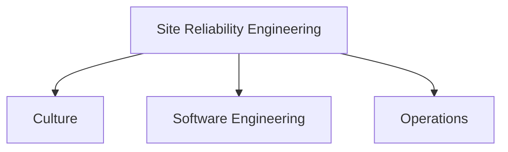

# 📚 SRE
> an attempt to centralize my SRE studies/links/annotations for reference purposes

**If you are new [click here](./INSTRUCTIONS.md) for instructions on how to use this repo**

## Links

* Site Reliability Engineering
  * [Culture](./culture/README.md)
  * [Software Engineering](./engineering/README.md)
  * [Operations](./operations/README.md)

### Tags
> Categories to the links

* 🌍 - Interesting Link
* 📰 - Article / Paper
* 📕 - Book
* 💻 - Project
* 🎓 - Online Course
* 📜 - Certification
* 📼 - Video Presentation / Content
* 🎥 - Slides Presentation
* ✍🏼 - Written/Made by me
* 📝 - My annotations
* 🆓 - Free / No money required
* 💰 - Paid
* 💪🏼 - Practice
* 🐦 - Person to Follow on Twitter
* ⭐️ - Favourite Option (when there are many alternatives)
* 👨🏻‍🔧- Workshop
