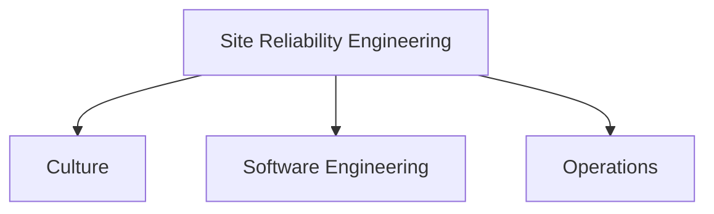

# 📚 SRE
> an attempt to centralize my SRE studies/links/annotations for reference purposes

## Disclaimer

This is how I perceive & think about SRE. I'm mostly spliting content in 3 fundamental (but not necessairly isolated) areas:
* Culture — What is SRE culture?
* Engineering — What software engineering traits contribute to SRE?
* Operations — What operaations (or sys-admin)

I think every SRE has different background, a few are SysAdmins who turned into Software Engineers others are Software who ended up owning large operations and eventually stumbled on SRE. *I'm myself more of the latter* thus a possible enphasis on operations and system-specific knowleddge (linux, pgsql, ...).

## How to use this repo?

The README topics/links are organized following above chart. High-level subjects are usually parent topics, sub-topics are usually specialization of the main subject.

The repo structure is focused on folders and markdown files. Each broad topic gets its own folder and it can go as deep as it needs.

Depending on your level, you can dive deeper into a subject's sub-topics, or just move to the next one.

e.g.:

SRE
  * Software Engineering
      * Databases
        * SQL
          * Postgres Basics
          * Postgres Internal
            * How postgres replication works
            * Parsing postgres WAL(WriteAheadLog)
      * Versioning

For instance, take into account the snaptshot above. If you already know how to use SQL Databases, you might want to either:

* Continue to the right, learning more more about Postgres, and to the bottom, its internals, specialized internals like replication and WAL.
* Continue to the bottom/next topic: `Programming Languages`.

### Finding topics

You can either navigate from the main links or simply search for your desired topic.

e.g.: ***I want to learn more about FinOps***

* Navigating: SRE > Operations > FinOps
* Searching: "FinOps" > FinOps page

### Tags
> Categories to the links

* 🌍 - Interesting Link
* 📰 - Article / Paper
* 📕 - Book
* 💻 - Project
* 🎓 - Online Course
* 📜 - Certification
* 📼 - Video Presentation / Content
* 🎥 - Slides Presentation
* ✍🏼 - Written/Made by me
* 📝 - My annotations
* 🆓 - Free / No money required
* 💰 - Paid
* 💪🏼 - Practice
* 🐦 - Person to Follow on Twitter
* ⭐️ - Favourite Option (when there are many alternatives)
* 👨🏻‍🔧- Workshop

## Links

* Site Reliability Engineering
  * [Culture](./culture/README.md)
  * [Software Engineering](./engineering/README.md)
  * [Operations](./operations/README.md)
