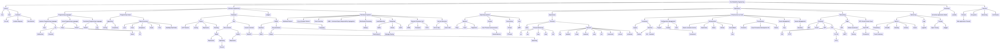

# 📚 Knowledge
> an attempt to centralize my studies/links/annotations for reference purposes

At the moment this is not useful for anyone but myself, if at some point I find it usefult I'll make it public.

(click to see the large version)

### More info
> Information about the links

* 🌍 - Interesting Link
* 📰 - Article / Paper
* 📕 - Book
* 💻 - Project
* 🎓 - Online Course
* 📼 - Video Presentation / Content
* 🎥 - Slides Presentation
* ✍🏼 - Written/Made by me
* 📝 - My annotations
* 🆓 - Free / No money required
* 💰 - Paid
* 💪🏼 - Practice
* 🐦 - Person to Follow on Twitter
* ⭐️ - Favourite Option (when there are many alternatives)

## References

* Site Reliability Engineering
  * Culture
    * General Overview
      * [Site Reliability Engineering - How Google Runs Production Systems](https://landing.google.com/sre/books/) 📕 🆓
        * [Annotations](/) - Coming Soon
      * [The Site Reliability Workbook - Practical Ways to Implement SRE](https://landing.google.com/sre/books/) 📕 🆓
      * [SRE - Keeping Google up and running 24/7](https://www.youtube.com/watch?v=yXI7r0_J29M) 📼 🆓
      * Google Series on SRE - class SRE implements DevOps
        * [What's the Difference Between DevOps and SRE?](https://www.youtube.com/watch?v=uTEL8Ff1Zvk) 📼 🆓
        * [SLIs, SLOs, SLAs, oh my!](https://www.youtube.com/watch?v=tEylFyxbDLE) 📼 🆓
        * [Risk and Error Budgets](https://www.youtube.com/watch?v=y2ILKr8kCJU) 📼 🆓
        * [Toil and Toil Budgets](https://www.youtube.com/watch?v=IvQ-15-yE_c) 📼 🆓
        * [Now SRE Everyone Else with CRE!](https://www.youtube.com/watch?v=GQPzaq-owYM) 📼 🆓
        * [Managing Risks as a Site Reliability Engineer](https://www.youtube.com/watch?v=4kGu1_M7Igg) 📼 🆓
        * [Actionable Alerting for Site Reliability Engineers](https://www.youtube.com/watch?v=CGldVD5wR-g) 📼 🆓
        * [Observability of Distributed Systems](https://www.youtube.com/watch?v=SoZZzB-yTOk) 📼 🆓
        * [Incident Management](https://www.youtube.com/watch?v=n4y9dwinPBQ) 📼 🆓
        * [Postmortems and Retrospectives](https://www.youtube.com/watch?v=UBe7U2b3tsA) 📼 🆓
    * Use cases
      * [Christof Leng - Site Reliability Engineering at Google](https://www.youtube.com/watch?v=d2wn_E1jxn4&) 📼 🆓
      * [Squarespace - Implementing SLOs for a New Service](https://www.youtube.com/watch?v=ffbGyHPWwZM) 📼 🆓
      * [Circonous - Shipping Software with an SRE Mindset](https://www.youtube.com/watch?v=TZWWkvxFXls) 📼 🆓
      * [Circonous - Latency SLOs Done Right](https://www.youtube.com/watch?v=iPotMqzOsDI) 📼 🆓
    * People to Follow
      * [Liz Fong-Jones](https://twitter.com/lizthegrey) 🐦
      * [Seth Vargo](https://twitter.com/sethvargo) 🐦

  * Software Engineering
    * Programming Languages
      * Paradigms
        * [Coursera - Programming Languages - Part A](https://www.coursera.org/learn/programming-languages) 📼 🎓 🆓
        * [Coursera - Programming Languages - Part B](https://www.coursera.org/learn/programming-languages-part-b) 📼 🎓 🆓
        * [Coursera - Programming Languages - Part C](https://www.coursera.org/learn/programming-languages-part-c) 📼 🎓 🆓
      * **Functional Programming Languages**
        * Haskell
          * General Overview
            * [Haskell From First Principles](http://haskellbook.com) 📕 💰
              * [Book Exercises](https://github.com/marceloboeira/hffp) 📝 💪🏼 🆓
            * [Simon Peyton Jones - Escape from the ivory tower - the Haskell journey](https://www.youtube.com/watch?v=re96UgMk6GQ) 📼 🆓
            * [Simon Peyton Jones - A History of Haskell - being lazy with class](https://www.youtube.com/watch?v=06x8Wf2r2Mc) 📼 🆓
            * [Andrew Rademacher - Demystifying Haskell](https://www.youtube.com/watch?v=apBWkBDVlow) 📼 🆓
          * Use cases
            * Facebook
              * [Bryan O'Sullivan - The Bright Side of High Level Languages](https://www.youtube.com/watch?v=kGa78HQv_LQ) 📼 🆓
              * [Jon Coens - The Road to Running Haskell at Facebook Scale](https://www.youtube.com/watch?v=sl2zo7tzrO8) 📼 🆓
          * Practice
            * [The Monad Challenges](http://mightybyte.github.io/monad-challenges/) 💪🏼 🆓
        * Concepts
          * Functional Programming
            * [Computerphile - Functional Programming & Haskell](https://www.youtube.com/watch?v=LnX3B9oaKzw) 📼 🆓
          * Lambda Calculus
            * [Computerphile - Lambda Calculus](https://www.youtube.com/watch?v=eis11j_iGMs) 📼 🆓
            * [Lambda Calculus - Fundamentals of Lambda Calculus & Functional Programming](https://www.youtube.com/watch?v=3VQ382QG-y4) 📼 🆓
            * [Lambda Calculis - Church Encodings && Combinators](https://www.youtube.com/watch?v=pAnLQ9jwN-E) 📼 🆓
            * The Y Combinator
              * [Computerphile - Y Combinator](https://www.youtube.com/watch?v=9T8A89jgeTI) 📼 🆓
          * Monads
            * [Computerphile - What is a Monad?](https://www.youtube.com/watch?v=t1e8gqXLbsU) 📼 🆓
      * **Systems Programming Languages**
        * Rust
          * [The Rust Programming Language](https://doc.rust-lang.org/stable/book/) 📕 🆓
            * [Annotations](https://github.com/marceloboeira/trpl) 📝
            * SubProjects
              * [grab](https://github.com/marceloboeira/grab) 👋🏼 like grep, but simpler [Chapters' 12/13 project].
              * [dull](https://github.com/marceloboeira/dull) 🤪 a dummy multi-thread HTTP server [Chapter's 20 project].
            * General Overview
              * [Aaron Turon - Rust: confident, productive systems programming](https://www.youtube.com/watch?v=C6dNx9pY7p8) 📼 🆓
              * [Steve Klabnik - The History of Rust](https://www.youtube.com/watch?v=79PSagCD_AY) 📼 🆓
            * Use cases
              * [Raph Levien - A Modern Editor Built in Rust](https://www.youtube.com/watch?v=SKtQgFBRUvQ) 📼 🆓
            * Testing Frameworks
              * [Speculate](https://github.com/utkarshkukreti/speculate.rs) Adds RSpec like behavior to rust via macros
        * Go
          * Garbage Collector
            * [Golang's Realtime GC in Theory and Practice](https://www.youtube.com/watch?v=bMujSVMarqY) 📼 🆓
    * Programming Topics
      * Algorithms and Data Structures
        * [Udacity - Intro to Data Structures and Algorithms by Google](https://eu.udacity.com/course/data-structures-and-algorithms-in-python--ud513) 🆓 🎓 📼
        * [Coursera - Algorithms - Part 1 - Elementary data structures, sorting, and searching algorithms](https://www.coursera.org/learn/algorithms-part1) 🆓 🎓 📼
        * [Coursera - Algorithms - Part 2 - Graph and string-processing algorithms](https://www.coursera.org/learn/algorithms-part2) 🆓 🎓 📼
        * [Courated List of the 10 best free resources](https://medium.freecodecamp.org/these-are-the-best-free-courses-to-learn-data-structures-and-algorithms-in-depth-4d52f0d6b35a) 📰 🆓
    * Databases
      * Theory
        * [Designing Data-Intensive Applications - Martin Kleppmann](http://dataintensive.net) 📕 💰
        * [CAP Theorem Revisited](http://robertgreiner.com/2014/08/cap-theorem-revisited/) 📰 🆓
      * SQL
        * PostgreSQL
          * [Updating a 50 terabyte PostgreSQL database](https://medium.com/adyen/updating-a-50-terabyte-postgresql-database-f64384b799e7) 📰 🆓
          * [How Twitch uses PostgreSQL](https://blog.twitch.tv/how-twitch-uses-postgresql-c34aa9e56f58) 📰 🆓
          * [Handling Growth with Postgres: 5 Tips From Instagram](https://instagram-engineering.com/handling-growth-with-postgres-5-tips-from-instagram-d5d7e7ffdfcb) 📰 🆓
          * [Updating a 50 terabyte PostgreSQL database](https://medium.com/adyen/updating-a-50-terabyte-postgresql-database-f64384b799e7) 📰 🆓
          * [Sharding & IDs at Instagram](https://instagram-engineering.com/sharding-ids-at-instagram-1cf5a71e5a5c) 📰 🆓
        * MySQL
          * [Learn to stop using shiny new things and love MySQL](https://medium.com/@Pinterest_Engineering/learn-to-stop-using-shiny-new-things-and-love-mysql-3e1613c2ce14) 📰 🆓
          * [Tracking the Money — Scaling Financial Reporting at Airbnb](https://medium.com/airbnb-engineering/tracking-the-money-scaling-financial-reporting-at-airbnb-6d742b80f040) 📰 🆓
          * [Scaling to 100M: MySQL is a Better NoSQL](https://www.wix.engineering/blog/scaling-to-100m-mysql-is-a-better-nosql) 📰 🆓
          * [Unlocking Horizontal Scalability in Our Web Serving Tier](https://medium.com/airbnb-engineering/unlocking-horizontal-scalability-in-our-web-serving-tier-d907449cdbcf) 📰 🆓
          * [Why Uber Engineering Switched from Postgres to MySQL](https://eng.uber.com/mysql-migration/) 📰 🆓
          * [Evaluating MySQL Parallel Replication Part 4, Annex: Under the Hood](https://medium.com/booking-com-infrastructure/evaluating-mysql-parallel-replication-part-4-annex-under-the-hood-eb456cf8b2fb) 📰 🆓
          * [Mitigating replication lag and reducing read load with freno](https://github.blog/2017-10-13-mitigating-replication-lag-and-reducing-read-load-with-freno/) 📰 🆓
          * [Black-Box Auditing: Verifying End-to-End Replication Integrity between MySQL and Redshift](https://engineeringblog.yelp.com/2018/04/black-box-auditing.html) 📰 🆓
          * [How We Partitioned Airbnb's Main Database in Two Weeks](https://medium.com/airbnb-engineering/how-we-partitioned-airbnb-s-main-database-in-two-weeks-55f7e006ff21)  📰 🆓
          * [Sharding Pinterest: How we scaled our MySQL fleet](https://medium.com/@Pinterest_Engineering/sharding-pinterest-how-we-scaled-our-mysql-fleet-3f341e96ca6f) 📰 🆓
          * [How We Replaced Our Data Pipeline With Zero Downtime](https://www.twilio.com/engineering/2014/06/26/how-we-replaced-our-data-pipeline-with-zero-downtime) 📰 🆓
        * Cassandra
          * [Cassandra at Instagram 2016](https://www.slideshare.net/DataStax/cassandra-at-instagram-2016) 📰 🆓
      * NoSQL
        * KeyValue
          * [BoJack](https://github.com/marceloboeira/bojack) ✍🏼 💻 🆓
          * [Why you should build your own NoSQL database](https://medium.com/@marceloboeira/why-you-should-build-your-own-nosql-database-9bbba42039f5) ✍🏼 📰 🆓
    * Distributed Systems
      * Event Sourcing / CQRS
        * [Go Back to the Future with Event Sourcing and CQRS](https://www.youtube.com/watch?v=iGt0DBOWDTs) 📼 🆓
        * [Event Sourcing You are doing it wrong - David Schmitz](https://www.youtube.com/watch?v=GzrZworHpIk) 📼 🆓
        * [The Many Meanings of Event-Driven Architecture - Martin Fowler](https://www.youtube.com/watch?v=STKCRSUsyP0) 📼 🆓
        * [An Introduction to CQRS and Event Sourcing Patterns - Mathew McLoughlin](https://www.youtube.com/watch?v=9a1PqwFrMP0) 📼 🆓
        * [Go Back to the Future with Event Sourcing and CQRS](https://www.youtube.com/watch?v=iGt0DBOWDTs) 📼 🆓
      * Streaming
        * [Kafka](https://kafka.apache.org)
          * [Introduction to Kafka](https://www.youtube.com/watch?v=UEg40Te8pnE) 📼 🆓
          * [Commit Logs in an Age of Microservices - Tim Berglund](https://www.youtube.com/watch?v=bbotWkCLuF0) 📼 🆓
          * [Should you put several event types in the same Kafka topic? - Martin Kleppmann](https://martin.kleppmann.com/2018/01/18/event-types-in-kafka-topic.html) 📰 🆓
          * Internals
            * [The Log: What every software engineer should know about real-time data's unifying abstraction](https://engineering.linkedin.com/distributed-systems/log-what-every-software-engineer-should-know-about-real-time-datas-unifying) 📰 🆓
            * [How Kafka's Storage Internals Work](https://thehoard.blog/how-kafkas-storage-internals-work-3a29b02e026) 📰 🆓
        * Kinesis
          * ["Distributed Commit Log: Application Techniques for Transaction Processing" by David McNeil](https://www.youtube.com/watch?v=X2g0FFOV2e0) 📼 🆓
        * Commit Log
          * [Commit Logs in an Age of Microservices - Tim Berglund](https://www.youtube.com/watch?v=bbotWkCLuF0) 📼 🆓
          * Build your Own
            * [14-bits/voik](https://github.com/14-bits/voik) 💻 🆓
            * [Corfu - A distributed shared log](https://blog.acolyer.org/2017/05/02/corfu-a-distributed-shared-log/) 📰 🆓
            * [Building a Distributed Message Log from Scratch by Tyler Treat - Video](https://www.youtube.com/watch?v=oKbm9XFxB2k) 📼 🆓
            * [Building a Distributed Log from Scratch, Part 1: Storage Mechanics](https://bravenewgeek.com/building-a-distributed-log-from-scratch-part-1-storage-mechanics/) 📰 🆓
            * [Building a Distributed Log from Scratch, Part 2: Data Replication](https://bravenewgeek.com/building-a-distributed-log-from-scratch-part-2-data-replication) 📰 🆓
            * [Building a Distributed Log from Scratch, Part 3: Scaling Message Delivery](https://bravenewgeek.com/building-a-distributed-log-from-scratch-part-3-scaling-message-delivery/) 📰 🆓
            * [Building a Distributed Log from Scratch, Part 4: Trade-Offs and Lessons Learned](https://bravenewgeek.com/building-a-distributed-log-from-scratch-part-4-trade-offs-and-lessons-learned/) 📰 🆓
            * [Building a Distributed Log from Scratch, Part 5: Sketching a New System](https://bravenewgeek.com/building-a-distributed-log-from-scratch-part-5-sketching-a-new-system/) 📰 🆓
            * Code
              * [travisjeffery/Jocko](https://github.com/travisjeffery/jocko) - Distributed commit log service in Go
              * [zowens/commitlog](http://github.com/zowens/commitlog) - Append-only commit log library for Rust
              * [liftbridge-io/liftbridge](http://github.com/liftbridge-io/liftbridge) - Lightweight, fault-tolerant message streams
            * People to Follow
              * [Tyler Treat](https://twitter.com/tyler_treat?lang=en) 🐦
      * Load Balancing
        * [Taking Zero-Downtime Load Balancing even Further](https://engineeringblog.yelp.com/2017/05/taking-zero-downtime-load-balancing-even-further.html) 📰 🆓
        * [Introducing the GitHub Load Balancer](https://github.blog/2016-09-22-introducing-glb/) 📰 🆓
        * [Improving load balancing with a new consistent-hashing algorithm](https://medium.com/vimeo-engineering-blog/improving-load-balancing-with-a-new-consistent-hashing-algorithm-9f1bd75709ed) 📰 🆓
        * [UDP Load Balancing with Keepalived](https://developers.500px.com/udp-load-balancing-with-keepalived-167382d7ad08) 📰 🆓
        * [Introducing QALM, Uber's QoS Load Management Framework](https://eng.uber.com/qalm/) 📰 🆓
  * Operations
    * Terminal
      * [Set of Bash Oneliners](https://github.com/onceupon/Bash-Oneliner) 💻 🆓
    * Operating Systems
      * Courses
        * [CS8803 - Introduction to Operating Systems](https://eu.udacity.com/course/introduction-to-operating-systems--ud923) 🎓 🆓
            * [Annotations and Exercises](https://github.com/marceloboeira/CS8803) 📝
      * Base Book (Choose 1):
        * [Operating Systems: Three Easy Pieces](http://pages.cs.wisc.edu/~remzi/OSTEP/) 📕 🆓 ⭐️
        * [Operating System Concepts](https://www.amazon.com/Operating-System-Concepts-Abraham-Silberschatz/dp/1118063333/ref=dp_ob_title_bk) 📕 💰
        * [Operating System Concepts: Essentials](https://www.amazon.com/Operating-Concepts-Essentials-Abraham-Silberschatz/dp/1118804929/ref=sr_1_1?s=books&ie=UTF8&qid=1415311059&sr=1-1&keywords=operating+system+concepts+essentials) 📕 💰
        * [Modern Operating Systems](https://www.amazon.com/Modern-Operating-Systems-4th-Edition/dp/013359162X/ref=dp_ob_title_bk) 📕 💰
      * Computer Architecture
        * [TUHS Lectures](https://minnie.tuhs.org/CompArch/Lectures/) 🆓 📰 🎓
          * [Introduction to Systems Architecture](https://minnie.tuhs.org/CompArch/Lectures/week01.html)
          * [Instruction Set Architecture Design](https://minnie.tuhs.org/CompArch/Lectures/week02.html)
          * [Addressing Modes & CPU Internals](https://minnie.tuhs.org/CompArch/Lectures/week03.html)
          * [Execution Flow, Branches, Function Calls](https://minnie.tuhs.org/CompArch/Lectures/week04.html)
          * [User- and Kernel Mode, System Calls, I/O, Exceptions](https://minnie.tuhs.org/CompArch/Lectures/week05.html)
          * [CPU Memory Management, Context Switching](https://minnie.tuhs.org/CompArch/Lectures/week06.html)
          * [Introduction to Operating Systems](https://minnie.tuhs.org/CompArch/Lectures/week07.html)
          * [Processes](https://minnie.tuhs.org/CompArch/Lectures/week08.html)
          * [Introduction to Memory Management](https://minnie.tuhs.org/CompArch/Lectures/week09.html)
          * [Virtual Memory, Disk Devices](https://minnie.tuhs.org/CompArch/Lectures/week10.html)
          * [Filesystems & Their Performance](https://minnie.tuhs.org/CompArch/Lectures/week11.html)
          * [IPC, Synchronisation and Threads](https://minnie.tuhs.org/CompArch/Lectures/week12.html)
       * Threads
         * ["An Introduction to Programming with Threads"](https://s3.amazonaws.com/content.udacity-data.com/courses/ud923/references/ud923-birrell-paper.pdf) by Birrell 📰 🆓
         * POSIX Threads (PThreads)
           * [PThreads / POSIX Threads Coding Examples](https://computing.llnl.gov/tutorials/pthreads/) 📰 🆓
        * [Beyond Multiprocessing: Multithreading the Sun OS Kernel by Eykholt](https://s3.amazonaws.com/content.udacity-data.com/courses/ud923/references/ud923-eykholt-paper.pdf) 📰 🆓
        * [Implementing Lightweight Threads by Stein and Shah](https://s3.amazonaws.com/content.udacity-data.com/courses/ud923/references/ud923-stein-shah-paper.pdf) 📰 🆓
        * [How to create and join threads in C (pthreads)](https://www.youtube.com/watch?v=uA8X5zNOGw8) 📼 🆓
       * Virtual Memory
         * [The Heap: what does malloc() do?](https://www.youtube.com/watch?v=HPDBOhiKaD8) 📼 🆓
         * mmap
           * [How processes get more memory](https://www.youtube.com/watch?v=XV5sRaSVtXQ) 📼 🆓
           * [How to Map Files into Memory in C (mmap)](https://www.youtube.com/watch?v=m7E9piHcfr4) 📼 🆓
       * Linux
         * [Linux Cross Reference](https://elixir.bootlin.com/linux/v3.17/source/include/linux/kthread.h#L66) 🌍 🆓
         * [Interactive Linux Kernel Map](http://www.makelinux.net/kernel_map/) 🌍 🆓
       * Reference Youtube channels
         * [Jacob Sorber](https://www.youtube.com/channel/UCwd5VFu4KoJNjkWJZMFJGHQ)
    * Network
      * [Computer Networks, 5th Edition](http://www.mypearsonstore.com/bookstore/computer-networks-9780132126953?xid=PSED) 📕 💰
      * Protocols
        * TCP
          * Build Your Own
            * [Implementing TCP in Rust (part 1)](https://www.youtube.com/watch?v=bzja9fQWzdA) 📼 🆓
            * [Implementing TCP in Rust (part 2)](https://www.youtube.com/watch?v=OCpt1I0MWXE) 📼 🆓
            * [Implementing TCP in Rust (part 3)](https://www.youtube.com/watch?v=8GE6ltLRJA4) 📼 🆓
            * [Implementing TCP in Rust (code)](https://github.com/jonhoo/rust-tcp) 🆓
    * Monitoring
      * Metrics
        * Prometheus
          * [Prometheus: Up & Running: Infrastructure and Application Performance Monitoring](https://www.amazon.de/gp/product/1492034142?pf_rd_p=99260c3e-e149-406d-b475-c299891fcd91&pf_rd_r=M0874DR76K58PTVG1NV7) 📕 💰
        * InfluxDB
          * [InfluxDB - Time Series Database](https://www.youtube.com/watch?v=2SUBRE6wGiA) 📼 🆓
    * Infrastructure as Code
      * [What is IaC?](https://www.youtube.com/watch?v=RO7VcUAsf-I) 📼 🆓
      * [Getting Started with IaC](https://www.youtube.com/watch?v=G3D14I5_NIk) 📼 🆓
      * Orchestration
        * Kubernetes
          * [Kubernetes Up and Running](http://shop.oreilly.com/product/0636920043874.do#tab_04_2) 📕 💰
          * [Key Kubernetes Concepts](https://towardsdatascience.com/key-kubernetes-concepts-62939f4bc08e) 📰 🆓
      * Provisioning
        * Terraform
          * [Introduction to Terraform](https://www.youtube.com/watch?v=h970ZBgKINg) 📼 🆓
          * [Infrastructure as Code in the Real World?](https://www.youtube.com/watch?v=S6vS5mzivFo) 📼 🆓
    * Linux
      * [LFS - Linux from Scratch Book](http://www.linuxfromscratch.org/lfs/downloads/8.4/LFS-BOOK-8.4.pdf) 📼 🆓
      * systemd
        * [systemd Essentials](https://www.digitalocean.com/community/tutorials/systemd-essentials-working-with-services-units-and-the-journal) 📰 🆓
    * Debug
      * Core Dumps
        * [Debugging with Core Dumps](https://www.youtube.com/watch?v=GV10eIuPs9k)
    * Performance
      * Profiling
        * Linux Performance
          * [Linux Network Performance Parameters](https://github.com/leandromoreira/linux-network-performance-parameters) 📰 🆓 💻
        * Applications
          * dtrace
            * [DTrace Book Scripts](https://github.com/brendangregg/DTrace-book-scripts) 💻 🆓
          * Rust
            * [Rustt + Dtrace + Flamegraphs](http://carol-nichols.com/2017/04/20/rust-profiling-with-dtrace-on-osx/) 📰 🆓
          * Flamegraph
            * [Tooling to generate FlameGraphs](https://github.com/brendangregg/FlameGraph) 💻 🆓
            * [Deep dive to CPU FlameGraphs](http://www.brendangregg.com/FlameGraphs/cpuflamegraphs.html) 📰 💻 🆓
            * [Speedscope - visualization tool](http://jamie-wong.com/post/speedscope/) 💻 🆓
            * [Presentation on FlameGraphs](https://speakerdeck.com/mrfoto/what-are-flame-graphs-and-how-to-read-them) 🎥 🆓
