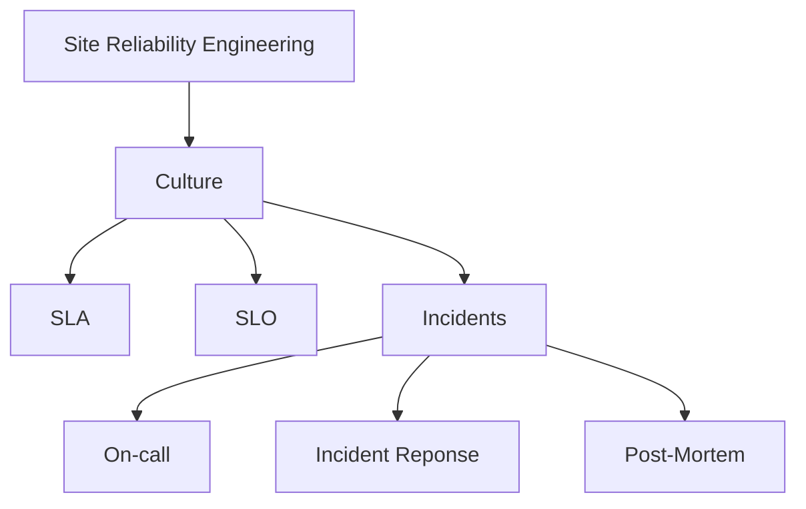

# [SRE](../README.md) > Culture

## Links

* Introductory
  * [So you want to be an SRE? - Krishelle Hardson-Hurley](https://hackernoon.com/so-you-want-to-be-an-sre-34e832357a8c) 📰 🆓
* Deeper Introduction
  * [Site Reliability Engineering - How Google Runs Production Systems](https://landing.google.com/sre/books/) 📕 🆓
  * [The Site Reliability Workbook - Practical Ways to Implement SRE](https://landing.google.com/sre/books/) 📕 🆓
  * [SRE - Keeping Google up and running 24/7](https://www.youtube.com/watch?v=yXI7r0_J29M) 📼 🆓
  * [Keys to SRE - Google](https://www.youtube.com/watch?v=n4Wf14e2jxQ) 📼 🆓
  * [Who/What? is SRE - Google (Panel)](https://www.youtube.com/watch?v=P83XESU3oZ8) 📼 🆓
  * Google Series on SRE - class SRE implements DevOps
    * [What's the Difference Between DevOps and SRE?](https://www.youtube.com/watch?v=uTEL8Ff1Zvk) 📼 🆓
    * [SLIs, SLOs, SLAs, oh my!](https://www.youtube.com/watch?v=tEylFyxbDLE) 📼 🆓
    * [Risk and Error Budgets](https://www.youtube.com/watch?v=y2ILKr8kCJU) 📼 🆓
    * [Toil and Toil Budgets](https://www.youtube.com/watch?v=IvQ-15-yE_c) 📼 🆓
    * [Now SRE Everyone Else with CRE!](https://www.youtube.com/watch?v=GQPzaq-owYM) 📼 🆓
    * [Managing Risks as a Site Reliability Engineer](https://www.youtube.com/watch?v=4kGu1_M7Igg) 📼 🆓
    * [Actionable Alerting for Site Reliability Engineers](https://www.youtube.com/watch?v=CGldVD5wR-g) 📼 🆓
    * [Observability of Distributed Systems](https://www.youtube.com/watch?v=SoZZzB-yTOk) 📼 🆓
    * [Incident Management](https://www.youtube.com/watch?v=n4y9dwinPBQ) 📼 🆓
    * [Postmortems and Retrospectives](https://www.youtube.com/watch?v=UBe7U2b3tsA) 📼 🆓
  * [IBM Garage - Building SRE from Scratch](https://medium.com/ibm-garage/building-sre-from-scratch-485e23985bbd)
* Use cases
  * [Site Reliability Engineering - Google - Christof Leng](https://www.youtube.com/watch?v=d2wn_E1jxn4&) 📼 🆓
  * [Implementing SLOs for a New Service - Squarespace](https://www.youtube.com/watch?v=ffbGyHPWwZM) 📼 🆓
  * [Shipping Software with an SRE Mindset - Circonous](https://www.youtube.com/watch?v=TZWWkvxFXls) 📼 🆓
  * [Latency SLOs Done Right - Circonous](https://www.youtube.com/watch?v=iPotMqzOsDI) 📼 🆓
  * [Site Reliability Engineering at Dropbox - Tammy Buttow](https://www.youtube.com/watch?v=ggizCjUCCqE) 📼 🆓
  * [190 Countries and 5 core SREs - Netflix - Jonah Horowitz](https://www.youtube.com/watch?v=koGaH4ffXaU) 📼 🆓
  * [The SRE I Aspire to Be - Usenix - Yaniv Aknin](https://www.youtube.com/watch?v=KnC2eRUZMKY) 📼 🆓
* People to Follow
  * [Liz Fong-Jones](https://twitter.com/lizthegrey) 🐦
  * [Seth Vargo](https://twitter.com/sethvargo) 🐦
  * [Tammy Buttow](https://twitter.com/tammybutow)
* Monitoring (See Operations Section)
* Incidents
  * Being on Call
    * [PagerDuty - Being on call](https://response.pagerduty.com/oncall/being_oncall/) 🆓
  * Reponse
    * [Google - Incident Management](https://www.youtube.com/watch?v=n4y9dwinPBQ) 🆓 📼
    * [PagerDuty - Incident Response Management](https://response.pagerduty.com) 🆓
    * [PagerDuty - Incident Reponse Course](https://www.youtube.com/watch?v=BI7nfkoTmiA) 🆓 📼
    * [FireHydrant - Incident Ready](https://www.youtube.com/watch?v=K2sf2lb2-4I) 🆓 📼
    * [O'Reilly - Incident Metrics in SRE](https://static.googleusercontent.com/media/sre.google/en//static/pdf/incident_metrics_in_sre.pdf) 📕 🆓
* Post-mortem
  * [Google - Postmortems & Retrospectives](https://www.youtube.com/watch?v=UBe7U2b3tsA) 🆓 📼
  * [PagerDuty - Post-mortems](https://response.pagerduty.com/after/post_mortem_process/) 🆓
