# [SRE](../README.md) > Engineering

```mermaid
graph TD
  SRE[Site Reliability Engineering]

  SRE --> SW[Software Engineering]
  SW --> PL[Programming Languages]
    PL --> SysPL[Systems Programming Languages]
      SysPL --> Rust
      SysPL --> Go
        Go --> GoRoutines
        Go --> Channels
        Go --> Select
        Go --> GC
    PL --> ScrPL[Script Programming Languages]
      ScrPL --> Ruby
      ScrPL --> Python
    PL --> FunPL[Functional Programming Languages]
      FunPL --> Haskell
      FunPL --> Lisp

  SW --> PT[Programming Topics]
    PT --> ALG[Algorithms]
      ALG --> SRT[Sorting]
      ALG --> CPX[Complexity]
    PT --> DS[Data Scructures]
      DS --> Lock[Lock]
      DS --> Futex[Futex]
      DS --> Semaphore
      DS --> Graph[Graph]
      DS --> T3[Tree]
      DS --> HS[HashMap/HashTable]

    SW --> DB[Databases]
      DB --> DBT[Theory]
        DBT --> CAP[CAP Theorem]
        DBT --> DBTS[Scaling]
        DBT --> DBTR[Replication]
        DBT --> DBTX[Sharding]
        DBT --> DBTO[Operating]
      DB --> SQL[SQL]
        SQL --> rSQL[Row-oriented]
          rSQL --> PgSQL
            PgSQL --> rSQLRep[Replication]
            PgSQL --> rSQLOps[Operating]
              rSQLOps --> rSQLOpsVac[Vacuum]
              rSQLOps --> rSQLOpsPerf[Performance]
                rSQLOpsPerf --> rSQLOpsPeQ[Query]
                 rSQLOpsPeQ --> rSQLOpsPeQbad[pgBadger]
          rSQL --> MySQL
            MySQL --> mSQLRep[Replication]
            MySQL --> mSQLOps[Operating]
        SQL --> cSQL[Column-oriented]
          cSQL --> Redshift
      DB --> NoSQL[NoSQL]
        NoSQL --> KV[KeyValue]
          KV --> Rd[Redis]
            Rd --> RdSn[Sentinel]
            Rd --> RdCls[Cluster]
            Rd --> RdRepl[Replication]
            Rd --> RdSh[Sharding]
            Rd --> RdRBAC[RBAC]
            Rd --> RdEC[ElastiCache]
              RdEC --> RdECG[Global Datastore]
          KV --> Mc[memcached]
        NoSQL --> Col[ColumnStore]
          Col --> HBas[HBase]
          Col --> Cas[Cassandra]
          Col --> Scy[ScylaDB]
          Col --> Dyn[DynamoDB]
        NoSQL --> DoS[DocumentStore]
          DoS --> Mng[MongoDB]
          DoS --> ES[ElasticSearch]
    SW --> LD[Ledgers]

  SW --> DSi[Distributed Systems]
    DSi --> BHP[Bulkhead Pattern]
    DSi --> CBP[Circuit Breaker Pattern]
    DSi --> EvS[Event Sourcing]
    DSi --> CQRS[CQRS - Command Query Responsibility Segregation]
    DSi --> DPro[Distributed Processing]
      DPro --> HDP[Hadoop]
    DSi --> DLB[Load Balancing]
    DSi --> STM[Streaming]
      STM --> Kafka
      STM --> Kinesis
      STM --> NATS
    DSi --> RPC[Remote Procedure Call]
      RPC --> fRPC[Frameworks]
        fRPC --> grpc[GRPC]
      RPC --> dfRPC[Data Format Protocols]
        dfRPC --> dfnRPC[Non-Binary]
          dfnRPC --> TEXT
          dfnRPC --> JSON
          dfnRPC --> YAML
        dfRPC --> dfbRPC[Binary]
          dfbRPC --> AVRO
          dfbRPC --> Protobufs
          dfbRPC --> Thrift
    DSi --> SDi[Service Discovery]
      SDi --> SDiSS[Server Side]
      SDi --> SDiCS[Client Side]
```

## Links

* Version Control
  * git
    * [Version Control with Git](https://learning.oreilly.com/library/view/version-control-with/9781449345037/) 📕 💰
* Programming Languages
  * Paradigms
    * [Coursera - Programming Languages - Part A](https://www.coursera.org/learn/programming-languages) 📼 🎓 🆓
    * [Coursera - Programming Languages - Part B](https://www.coursera.org/learn/programming-languages-part-b) 📼 🎓 🆓
    * [Coursera - Programming Languages - Part C](https://www.coursera.org/learn/programming-languages-part-c) 📼 🎓 🆓
  * **Functional Programming Languages**
    * Haskell
      * General Overview
        * [Haskell From First Principles](http://haskellbook.com) 📕 💰
          * [Book Exercises](https://github.com/marceloboeira/hffp) 📝 💪🏼 🆓
        * [Simon Peyton Jones - Escape from the ivory tower - the Haskell journey](https://www.youtube.com/watch?v=re96UgMk6GQ) 📼 🆓
        * [Simon Peyton Jones - A History of Haskell - being lazy with class](https://www.youtube.com/watch?v=06x8Wf2r2Mc) 📼 🆓
        * [Andrew Rademacher - Demystifying Haskell](https://www.youtube.com/watch?v=apBWkBDVlow) 📼 🆓
      * Use cases
        * Facebook
          * [Bryan O'Sullivan - The Bright Side of High Level Languages](https://www.youtube.com/watch?v=kGa78HQv_LQ) 📼 🆓
          * [Jon Coens - The Road to Running Haskell at Facebook Scale](https://www.youtube.com/watch?v=sl2zo7tzrO8) 📼 🆓
      * Practice
        * [The Monad Challenges](http://mightybyte.github.io/monad-challenges/) 💪🏼 🆓
    * Concepts
      * Functional Programming
        * [Computerphile - Functional Programming & Haskell](https://www.youtube.com/watch?v=LnX3B9oaKzw) 📼 🆓
      * Lambda Calculus
        * [Computerphile - Lambda Calculus](https://www.youtube.com/watch?v=eis11j_iGMs) 📼 🆓
        * [Lambda Calculus - Fundamentals of Lambda Calculus & Functional Programming](https://www.youtube.com/watch?v=3VQ382QG-y4) 📼 🆓
        * [Lambda Calculis - Church Encodings && Combinators](https://www.youtube.com/watch?v=pAnLQ9jwN-E) 📼 🆓
        * The Y Combinator
          * [Computerphile - Y Combinator](https://www.youtube.com/watch?v=9T8A89jgeTI) 📼 🆓
      * Monads
        * [Computerphile - What is a Monad?](https://www.youtube.com/watch?v=t1e8gqXLbsU) 📼 🆓
        * [Functional Programming Patterns for Mere Mortals - Daniel Chambers](https://www.youtube.com/watch?v=v9QGWbGppis) 📼 🆓
  * **Systems Programming Languages**
    * Rust
      * [The Rust Programming Language](https://doc.rust-lang.org/stable/book/) 📕 🆓
        * [Annotations](https://github.com/marceloboeira/trpl) 📝
        * SubProjects
          * [grab](https://github.com/marceloboeira/grab) 👋🏼 like grep, but simpler [Chapters' 12/13 project].
          * [dull](https://github.com/marceloboeira/dull) 🤪 a dummy multi-thread HTTP server [Chapter's 20 project].
      * General Overview
        * [Aaron Turon - Rust: confident, productive systems programming](https://www.youtube.com/watch?v=C6dNx9pY7p8) 📼 🆓
        * [Steve Klabnik - The History of Rust](https://www.youtube.com/watch?v=79PSagCD_AY) 📼 🆓
      * Use cases
        * [Raph Levien - A Modern Editor Built in Rust](https://www.youtube.com/watch?v=SKtQgFBRUvQ) 📼 🆓
      * Testing Frameworks
        * [Speculate](https://github.com/utkarshkukreti/speculate.rs) Adds RSpec like behavior to rust via macros
      * [Programming Rust](https://learning.oreilly.com/library/view/programming-rust/9781491927274/) 📕 💰
    * Go
      * Concurrency
        * [Concurrency in Go](https://learning.oreilly.com/library/view/concurrency-in-go/9781491941294/) 📕 💰
        * [Concurrency Patterns in Go](https://www.youtube.com/watch?v=YEKjSzIwAdA 📼 🆓)
          * Channels
            * [How do channels work? - Kavya Joshi - GopherCon 2017](https://www.youtube.com/watch?v=KBZlN0izeiY) 📼🆓⭐️
            * [Practical Channel Work](https://www.youtube.com/watch?v=S11VFAMEs6E) 📼 🆓
      * Garbage Collector
        * [Golang's Realtime GC in Theory and Practice](https://www.youtube.com/watch?v=bMujSVMarqY) 📼 🆓
        * [Garbage Colletor Handbook](https://learning.oreilly.com/library/view/the-garbage-collection/9781315388007/) 📕 💰
* Programming Topics
  * Algorithms and Data Structures
    * [Udacity - Intro to Data Structures and Algorithms by Google](https://eu.udacity.com/course/data-structures-and-algorithms-in-python--ud513) 🆓 🎓 📼
    * [Coursera - Algorithms - Part 1 - Elementary data structures, sorting, and searching algorithms](https://www.coursera.org/learn/algorithms-part1) 🆓 🎓 📼
    * [Coursera - Algorithms - Part 2 - Graph and string-processing algorithms](https://www.coursera.org/learn/algorithms-part2) 🆓 🎓 📼
    * [Courated List of the 10 best free resources](https://medium.freecodecamp.org/these-are-the-best-free-courses-to-learn-data-structures-and-algorithms-in-depth-4d52f0d6b35a) 📰 🆓
     * Locks
       * [Let's talk locks! - Kavya Joshi](https://www.youtube.com/watch?v=tjpncm3xTTc) 📼 🆓
     * Futex
     * Semaphores
     * Alternative Data Structures
       * [“Esoteric Data Structures and Where to Find Them” - Allan Deutsch](https://www.youtube.com/watch?v=-8UZhDjgeZU) 📼 🆓
            * 0:36 Slot map
            * 10:08 Bloom filters (non-counting)
            * 16:46 Navigation meshes
            * 20:36 Hash pointer / Block chain / Merkle tree
       * Probabilistic Data Structures
         * Bloom Filter
           * [An Introduction to Bloom Filter (Probably Yes, Always No)](https://www.youtube.com/watch?v=x2sLjRK56YU) 📼 🆓
           * [Bloom Filters](https://www.youtube.com/watch?v=heEDL9usFgs) 📼 🆓
           * [Bloom filter for System Design applications](https://www.youtube.com/watch?v=Bay3X9PAX5k) 📼 🆓
           * [Bloom Filters](https://www.youtube.com/watch?v=bEmBh1HtYrw) 📼 🆓
         * Count-Min-Sketch
           * [Big Data with Sketchy Structures, Part 1 — the Count-Min Sketch](https://towardsdatascience.com/big-data-with-sketchy-structures-part-1-the-count-min-sketch-b73fb3a33e2a) 📰 🆓
           * [Count min sketch | Efficient algorithm for counting stream of data | system design components](https://www.youtube.com/watch?v=ibxXO-b14j4) 📼 🆓
* Databases
  * Theory
    * [Designing Data-Intensive Applications - Martin Kleppmann](http://dataintensive.net) 📕 💰
    * [CAP Theorem Revisited](http://robertgreiner.com/2014/08/cap-theorem-revisited/) 📰 🆓
    * [The Pathologies of Big Data](https://queue.acm.org/detail.cfm?id=1563874) 📰 🆓
    * Scaling
    * Replication
      * --
    * Sharding
      * [Understanding Database Sharding - DigitalOcean](https://www.digitalocean.com/community/tutorials/understanding-database-sharding) 📰 🆓 ⭐️
      * [Sharding in Plain English - Citrus Data Blog](https://www.citusdata.com/blog/2018/01/10/sharding-in-plain-english/) 📰 🆓
      * [Introduction to Sharding - B's March (MongoDB Focused)](https://www.youtube.com/watch?v=4upppuW7lGE) 📼 🆓
      * [Sharding & Database Partitioning | System Design Basics](https://www.youtube.com/watch?v=RynPj8C0BXA) 📼 🆓
      * [System Design - Sharding | Data Partitioning](https://www.youtube.com/watch?v=yNrVexoEnFM) 📼 🆓
     * Operating
       * [Your Database Connection Deserves A Name - Andy Grunwald](https://andygrunwald.com/blog/your-database-connection-deserves-a-name/) 📰 🆓
  * SQL
    * Row-based
      * PostgreSQL
        * [Postgres: Up & Running](https://learning.oreilly.com/library/view/postgresql-up-and/9781491963401/) 📕 💰 ⭐️
        * [Learning PostgreSQL 11](https://learning.oreilly.com/library/view/learning-postgresql-11/9781789535464/) 📕 💰
        * [Mastering PostgreSQL 11 - Second Edition](https://learning.oreilly.com/library/view/mastering-postgresql-11/9781789537819/) 📕 💰
        * [Understanding Advanced Datatypes in PostgreSQL](https://www.youtube.com/watch?v=h0eEJ7uX13Q) 📼 🆓
        * [Updating a 50 terabyte PostgreSQL database](https://medium.com/adyen/updating-a-50-terabyte-postgresql-database-f64384b799e7) 📰 🆓
        * [How Twitch uses PostgreSQL](https://blog.twitch.tv/how-twitch-uses-postgresql-c34aa9e56f58) 📰 🆓
        * [Handling Growth with Postgres: 5 Tips From Instagram](https://instagram-engineering.com/handling-growth-with-postgres-5-tips-from-instagram-d5d7e7ffdfcb) 📰 🆓
        * [Updating a 50 terabyte PostgreSQL database](https://medium.com/adyen/updating-a-50-terabyte-postgresql-database-f64384b799e7) 📰 🆓
        * [Sharding & IDs at Instagram](https://instagram-engineering.com/sharding-ids-at-instagram-1cf5a71e5a5c) 📰 🆓
        * [Sharding and Scaling PostgreSQL: Principles and Practice Webinar](https://www.youtube.com/watch?v=mbXPbLjiYTI) 📼 🆓
        * [Citus vs. Single-Node Postgres Database | A Side-by-Side Comparison](https://www.youtube.com/watch?v=g3H4nGsJsl0) 📼 🆓
        * Replication
          * [Three Approaches to PostgreSQL Replication and Backup](https://www.citusdata.com/blog/2018/02/21/three-approaches-to-postgresql-replication/) 📰 🆓
          * [PostgreSQL Streaming Replication](https://www.youtube.com/watch?v=NaPnYQBBdyU) 📼 🆓
          * [PostgreSQL Replication Concepts](https://www.youtube.com/watch?v=fsMvr96gTjY) 📼 🆓
          * [PostgreSQL Replication by example - Kobus Wolvaardt](https://www.youtube.com/watch?v=5BeC1aD4z8E) 📼 🆓 ⭐️
        * Monitoring
          * [Key metrics for Amazon RDS PostgreSQL monitoring](https://www.datadoghq.com/blog/aws-rds-postgresql-monitoring/) 📰 🆓
        * Operating
          * Vacuum
            * [Optimizing Storage and Managing Cleanup in PostgreSQL - Harshit Dwivedi](https://medium.com/coding-blocks/optimizing-storage-and-managing-cleanup-in-postgresql-c2fe56d4cf5) ⭐️ 📰 🆓
            * [Optimizing, monitoring, and troubleshooting VACUUM operations in PostgreSQL - GCP](https://cloud.google.com/solutions/optimizing-monitoring-troubleshooting-vacuum-operations-postgresql.pdf) 📰 🆓
            * [PgBouncer - Setup and Performance Use-cases](https://medium.com/swlh/pgbouncer-installation-configuration-and-use-cases-for-better-performance-1806316f3a22) 📰 🆓
          * Performance
            * Query Performance
              * [pgBadger](https://pgbadger.darold.net/)
                * [Example Report](https://pgbadger.darold.net/samplev7.html)
                * [Optimizing and tuning queries in Amazon RDS PostgreSQL based on native and external tools](https://aws.amazon.com/blogs/database/optimizing-and-tuning-queries-in-amazon-rds-postgresql-based-on-native-and-external-tools/)
                * [Fixing your slow queries](https://www.youtube.com/watch?v=qdGhbpvU5vk)
      * MySQL
        * [Learn to stop using shiny new things and love MySQL](https://medium.com/@Pinterest_Engineering/learn-to-stop-using-shiny-new-things-and-love-mysql-3e1613c2ce14) 📰 🆓
        * [Tracking the Money — Scaling Financial Reporting at Airbnb](https://medium.com/airbnb-engineering/tracking-the-money-scaling-financial-reporting-at-airbnb-6d742b80f040) 📰 🆓
        * [Scaling to 100M: MySQL is a Better NoSQL](https://www.wix.engineering/blog/scaling-to-100m-mysql-is-a-better-nosql) 📰 🆓
        * [Unlocking Horizontal Scalability in Our Web Serving Tier](https://medium.com/airbnb-engineering/unlocking-horizontal-scalability-in-our-web-serving-tier-d907449cdbcf) 📰 🆓
        * [Why Uber Engineering Switched from Postgres to MySQL](https://eng.uber.com/mysql-migration/) 📰 🆓
        * [Evaluating MySQL Parallel Replication Part 4, Annex: Under the Hood](https://medium.com/booking-com-infrastructure/evaluating-mysql-parallel-replication-part-4-annex-under-the-hood-eb456cf8b2fb) 📰 🆓
        * [Mitigating replication lag and reducing read load with freno](https://github.blog/2017-10-13-mitigating-replication-lag-and-reducing-read-load-with-freno/) 📰 🆓
        * [Black-Box Auditing: Verifying End-to-End Replication Integrity between MySQL and Redshift](https://engineeringblog.yelp.com/2018/04/black-box-auditing.html) 📰 🆓
        * [How We Partitioned Airbnb's Main Database in Two Weeks](https://medium.com/airbnb-engineering/how-we-partitioned-airbnb-s-main-database-in-two-weeks-55f7e006ff21)  📰 🆓
        * [Sharding Pinterest: How we scaled our MySQL fleet](https://medium.com/@Pinterest_Engineering/sharding-pinterest-how-we-scaled-our-mysql-fleet-3f341e96ca6f) 📰 🆓
        * [How We Replaced Our Data Pipeline With Zero Downtime](https://www.twilio.com/engineering/2014/06/26/how-we-replaced-our-data-pipeline-with-zero-downtime) 📰 🆓
        * [Vitess: MySQL Sharding - Square Engineering](https://www.youtube.com/watch?v=q65TleTn2vg) 📼 🆓
     * RDS
       * Aurora
         * [Amazon Aurora Multi-Master: Scaling out database write performance (MySQL)](https://www.youtube.com/watch?v=p0C0jakzYuc) 📼 🆓
         * [Aurora Encryption Performance Numbers](https://aws.amazon.com/blogs/database/selecting-the-right-encryption-options-for-amazon-rds-and-amazon-aurora-database-engines/) 📰 🆓
         * [Aurora Global Database](https://www.youtube.com/watch?v=1vFg1z-2E7Y) 📼 🆓
         * Performance Tunning
           * [Part 1 - Memory and Query Plan Management](https://aws.amazon.com/blogs/database/amazon-aurora-postgresql-parameters-part-1-memory-and-query-plan-management/) 📰 🆓
           * [Part 2 - Replications Security and Logging](https://aws.amazon.com/blogs/database/amazon-aurora-postgresql-parameters-part-2-replication-security-and-logging/) 📰 🆓
           * [Part 3 - Optimizer Params](https://aws.amazon.com/blogs/database/amazon-aurora-postgresql-parameters-part-3-optimizer-parameters/) 📰 🆓
           * [Part 4 - ANSI Compatibility Options](https://aws.amazon.com/blogs/database/amazon-aurora-postgresql-parameters-part-4-ansi-compatibility-options/) 📰 🆓
       * [Security](https://aws.amazon.com/rds/features/security/)
         * [Encryptin an exsting RDS PgSQL](https://docs.aws.amazon.com/prescriptive-guidance/latest/patterns/encrypt-an-existing-amazon-rds-for-postgresql-db-instance.html) 📰 🆓
       * RDS Proxy
         * [Introduction to RDS Proxy](https://www.youtube.com/watch?v=ULRnn6tIYu8) 📼 🆓
         * [Using Relational Databases with AWS Lambda - Easy Connection Pooling](https://www.youtube.com/watch?v=dgj9cvqgYYs) 📼 🆓
       * Aurora Serverless
         * [How to Build Highly Scalable Serverless Applications with Amazon Aurora Serverless](https://www.youtube.com/watch?v=I0uHo4xAIxg) 📼 🆓
         * Data API
           * [Getting Started with Aurora Serverless Data API](https://www.youtube.com/watch?v=b_BzV1G1iRs) 📼 🆓
       * Cross-region Replication
         * [Best practices for Amazon RDS for PostgreSQL cross-Region read replicas](https://aws.amazon.com/blogs/database/best-practices-for-amazon-rds-for-postgresql-cross-region-read-replicas/) 📰 🆓
    * Column-based
      * Redshift
        * Materialized Views
          * [Docs](https://docs.aws.amazon.com/redshift/latest/dg/materialized-view-overview.html) 📰 🆓
          * [Overview](https://www.youtube.com/watch?v=mQAs44MHmeY) 📼 🆓
          * [Deep-Dive](https://www.youtube.com/watch?v=PjBMZW4Ze0c) 📼 🆓
  * NoSQL
    * History
      * Early 80s - Relational Databases
          * TODO
      * Late 90s - CAP Theorem
          *
      * Late 2000s
        * [The Dynamo Paper (Amazon)](https://www.allthingsdistributed.com/files/amazon-dynamo-sosp2007.pdf)
        * [The BigTable Paper (Google)](https://static.googleusercontent.com/media/research.google.com/en//archive/bigtable-osdi06.pdf)
    * Generic
      * [AWS re:Invent 2021 - Which NoSQL database is right for you?](https://www.youtube.com/watch?v=ivBaro-8PhI) 📼 🆓
    * KeyValue
      * [BoJack](https://github.com/marceloboeira/bojack) ✍🏼 💻 🆓
      * [Why you should build your own NoSQL database](https://medium.com/@marceloboeira/why-you-should-build-your-own-nosql-database-9bbba42039f5) ✍🏼 📰 🆓
      * Redis
        * Introduction
          * [What is Redis? - Jamil Spain](https://www.youtube.com/watch?v=muqiHwa8UvQ) 📼 🆓
          * [Redis Explained](https://architecturenotes.co/redis/)
          * [Redis Cookbook](https://learning.oreilly.com/library/view/redis-4x-cookbook/9781783988167/) 📕 💰
        * Usecases
          * [AWS re:Invent 2020: Beyond caching: Advanced design patterns in Redis](https://www.youtube.com/watch?v=2WkJeofqIJg)
          * [Airbnb - Migrating to ElastiCache](https://www.youtube.com/watch?v=eyd_8efUCwM) 📼 🆓
        * Internals
          * Cache
            * [What happens when Redis runs out of memory? - Elena Kolevska](https://www.youtube.com/watch?v=W8IEzoxRMz4) 📼 🆓
          * Replication
              * [How Redis Replication Works](https://redis.com/blog/the-endless-redis-replication-loop-what-why-and-how-to-solve-it/) 📰 🆓
          * Streams
            * [Redis Streams](https://www.youtube.com/watch?v=qXEyuUxQXZM) 📼 🆓
          * Sentinel
            * [Redis Sentinel in Nutshell](https://www.youtube.com/watch?v=85HzpIk7Mq8)
          * Cluster
            * [Building for high availability and extreme performance with Redis cluster, AWS - Madelyn Olson](https://www.youtube.com/watch?v=LLxWu27qQTI) ⭐️ 📼 🆓
            * [AWS Scaling Your Redis Workloads with Redis Cluster](https://www.youtube.com/watch?v=3Ovx5vJ17ws) 📼 🆓
          * RBAC/RedisAuth
            * [Redis Best Practices](https://www.youtube.com/watch?v=_4SkEy6r-C4) 📼 🆓
          * Enterprise
            * [High Availability and Scalability with Redis Enterprise](https://medium.com/@octoz/high-availability-and-scalability-with-redis-enterprise-54a48edcce17) 📰 🆓
        * Monitoring
          * [Datadog - How to Monitor Redis Performance Metrics - Part 1](https://www.datadoghq.com/blog/how-to-monitor-redis-performance-metrics/) 📰 🆓
          * [Datadog - How to Monitor Redis Performance Metrics - Part 2](https://www.datadoghq.com/blog/how-to-collect-redis-metrics/) 📰 🆓
          * [Datadog - How to Monitor Redis Performance Metrics - Part 3](https://www.datadoghq.com/blog/how-to-monitor-redis-performance-metrics/) 📰 🆓
          * [What Happens When Redis Runs Out of Memory?](https://www.youtube.com/watch?v=W8IEzoxRMz4) 📼 🆓
          * ElastiCache Specific
            * [Monitoring ElastiCache with AWS-Native metrics](https://www.datadoghq.com/blog/monitor-elasticache-with-aws-metrics-native-metrics/)  📰 🆓
            * [Monitoring ElastiCache wth enhanced metrics](https://www.datadoghq.com/blog/monitoring-elasticache-performance-metrics-with-redis-or-memcached/) 📰 🆓
          * Operating
            * [Redis Replication Buffer](https://redis.com/blog/top-redis-headaches-for-devops-replication-buffer/) 📰 🆓
        * Hosted
          * ElastiCache
            * [AWS re:Invent 2020: Design for success with Amazon ElastiCache best practices](https://www.youtube.com/watch?v=_4SkEy6r-C4) 📼 🆓
            * [AWS re:Invent 2021 - Deep dive on Amazon ElastiCache for Redis - Groupon - DataTiering](https://www.youtube.com/watch?v=QEKDpToureQ)  📼 🆓
            * Global Datastore - Cross-region replication (DR)
              * [Redis Global Datastore](https://aws.amazon.com/blogs/aws/now-available-amazon-elasticache-global-datastore-for-redis/) 📰 🆓
    * Column Store
      * DynamoDB - Yeah, DynamoDB says K:V but really... it's a Column Store (even thought the DynamoDB Paper was for a KV Store)
        * [Paper](https://www.allthingsdistributed.com/files/amazon-dynamo-sosp2007.pdf)
      * HBase
      * Cassandra
        * [Cassandra: Introduction by DATASAX](https://www.youtube.com/watch?v=B_HTdrTgGNs) 📼 🆓
        * [Cassandra at Instagram 2016](https://www.slideshare.net/DataStax/cassandra-at-instagram-2016) 📰 🆓
        * [Cassandra: The Definitive Guide](https://learning.oreilly.com/library/view/cassandra-the-definitive/9781491933657/) 📕 💰
        * Amazon Keyspaces
          * [Running Apache Cassandra Workloads by Using Amazon Keyspaces](https://www.youtube.com/watch?v=zehVQzlSuEU) 🆓 📼
    * DocumentStore
      * MongoDB
      * ElasticSearch
        * Internals
          * [ElasticSearch from the Bottom Up](https://www.youtube.com/watch?v=PpX7J-G2PEo) 📼 🆓
          * [ElasticSearch from the Bottom Up](https://www.elastic.co/blog/found-elasticsearch-from-the-bottom-up) 📼 🆓
              * [Index && Shard](https://www.youtube.com/watch?v=YsYUgZu9-Y4) 📼 🆓
                * [How many shards are too many shards?](https://www.youtube.com/watch?v=uryHucNEZXk) 📼 🆓
                  * [Shard performance patterns](https://www.youtube.com/watch?v=aG6WPu08qBs) 📼 🆓
              * Lucene
        * [Elasticsearch Do's, Don'ts and Pro-Tips](https://www.youtube.com/watch?v=c9O5_a50aOQ) 📼 🆓
        * [Our Journey with Elasticsearch: Indexing 200M Daily Records](https://www.youtube.com/watch?v=nqUB0erNlec) 📼 🆓
* Ledger
  * [What is a Ledger?](https://www.youtube.com/watch?v=BiEbMJ86dGQ) 📼 🆓
  * [Amazon QLDB: An engineer's deep dive on why this is a game changer](https://www.youtube.com/watch?v=ZfYDl4kaVCo) 📼 🆓
* Distributed Systems
  * Theory
    * [Fallacies of Distributed Computing](https://en.wikipedia.org/wiki/Fallacies_of_distributed_computing) 📰 🆓
    * [Distributed Systems, 2nd Edition](https://learning.oreilly.com/library/view/distributed-systems-2nd/9781466552975/) 📕 💰
    * [Distributed Systems Observability](https://learning.oreilly.com/library/view/distributed-systems-observability/9781492033431/) 📕 💰
    * [Designing Distributed Systems](https://learning.oreilly.com/library/view/designing-distributed-systems/9781491983638/) 📕 💰
    * [Distributed Denial of Service (DDoS)](https://learning.oreilly.com/library/view/distributed-denial-of/9781492026181/) 📕 💰
    * [Distributed Systems Training](https://github.com/pingcap/talent-plan) 📰 🆓
  * Service Discovery
    * [AWS CloudMap](https://youtu.be/fMGd9IUaotE)
    * [Airbnb - SmartStack](https://medium.com/airbnb-engineering/smartstack-service-discovery-in-the-cloud-4b8a080de619)
  * Bulkhead Pattern
    * [Bulkhead Pattern - Origin & Concept](https://www.youtube.com/watch?v=Kh3HxWk8YF4) 📼 🆓
    * [Bulkhead Pattern - Examples](https://www.youtube.com/watch?v=R2FT5edyKOg) 📼 🆓
  * Circuit-Breaker Pattern
    * [Circuit Breaker Pattern - Fault Toleranc Services](https://www.youtube.com/watch?v=ADHcBxEXvFA) 📼 🆓
  * Event-Driven Architecture
    * [Practical Event Driven Architecture](https://www.youtube.com/watch?v=X5PZ9TwDjI8) 📼 🆓
    * Event Sourcing / CQRS
      * [Go Back to the Future with Event Sourcing and CQRS](https://www.youtube.com/watch?v=iGt0DBOWDTs) 📼 🆓
      * [Event Sourcing You are doing it wrong - David Schmitz](https://www.youtube.com/watch?v=GzrZworHpIk) 📼 🆓
      * [The Many Meanings of Event-Driven Architecture - Martin Fowler](https://www.youtube.com/watch?v=STKCRSUsyP0) 📼 🆓
      * [An Introduction to CQRS and Event Sourcing Patterns - Mathew McLoughlin](https://www.youtube.com/watch?v=9a1PqwFrMP0) 📼 🆓
      * [Go Back to the Future with Event Sourcing and CQRS](https://www.youtube.com/watch?v=iGt0DBOWDTs) 📼 🆓
  * Streaming
    * [Kafka](https://kafka.apache.org)
      * [Introduction to Kafka](https://www.youtube.com/watch?v=UEg40Te8pnE) 📼 🆓
      * [Commit Logs in an Age of Microservices - Tim Berglund](https://www.youtube.com/watch?v=bbotWkCLuF0) 📼 🆓
      * [Should you put several event types in the same Kafka topic? - Martin Kleppmann](https://martin.kleppmann.com/2018/01/18/event-types-in-kafka-topic.html) 📰 🆓
      * Practical
        * [Kafka: The Definitive Guide](https://learning.oreilly.com/library/view/kafka-the-definitive/9781491936153/) 📕 💰
        * [Kafka to MSK: MirrorMaker/ApacheFlink/Capacity Planning](https://www.youtube.com/watch?v=CmcJb9Ge3jI) 📼 🆓
      * Internals
        * [The Log: What every software engineer should know about real-time data's unifying abstraction](https://engineering.linkedin.com/distributed-systems/log-what-every-software-engineer-should-know-about-real-time-datas-unifying) 📰 🆓
        * [How Kafka's Storage Internals Work](https://thehoard.blog/how-kafkas-storage-internals-work-3a29b02e026) 📰 🆓
        * [Why is Kafka so fast](http://searene.me/2017/07/09/Why-is-Kafka-so-fast/) 📰 🆓
    * NATS
      * [Practical NATS: From Beginner to Pro](https://www.amazon.com/Practical-NATS-Beginner-Waldemar-Quevedo/dp/148423569X) 📕 💰
    * Kinesis
      * ["Distributed Commit Log: Application Techniques for Transaction Processing" by David McNeil](https://www.youtube.com/watch?v=X2g0FFOV2e0) 📼 🆓
        * [Amazon Kinesis Data Streams: Auto-scaling the number of shards](https://medium.com/slalom-data-analytics/amazon-kinesis-data-streams-auto-scaling-the-number-of-shards-105dc967bed5) 📰 🆓
    * Commit Log
      * [Commit Logs in an Age of Microservices - Tim Berglund](https://www.youtube.com/watch?v=bbotWkCLuF0) 📼 🆓
      * Build your Own
        * [14-bits/voik](https://github.com/14-bits/voik) 💻 🆓
        * [Corfu - A distributed shared log](https://blog.acolyer.org/2017/05/02/corfu-a-distributed-shared-log/) 📰 🆓
        * [Building a Distributed Message Log from Scratch by Tyler Treat - Video](https://www.youtube.com/watch?v=oKbm9XFxB2k) 📼 🆓
        * [Building a Distributed Log from Scratch, Part 1: Storage Mechanics](https://bravenewgeek.com/building-a-distributed-log-from-scratch-part-1-storage-mechanics/) 📰 🆓
        * [Building a Distributed Log from Scratch, Part 2: Data Replication](https://bravenewgeek.com/building-a-distributed-log-from-scratch-part-2-data-replication) 📰 🆓
        * [Building a Distributed Log from Scratch, Part 3: Scaling Message Delivery](https://bravenewgeek.com/building-a-distributed-log-from-scratch-part-3-scaling-message-delivery/) 📰 🆓
        * [Building a Distributed Log from Scratch, Part 4: Trade-Offs and Lessons Learned](https://bravenewgeek.com/building-a-distributed-log-from-scratch-part-4-trade-offs-and-lessons-learned/) 📰 🆓
        * [Building a Distributed Log from Scratch, Part 5: Sketching a New System](https://bravenewgeek.com/building-a-distributed-log-from-scratch-part-5-sketching-a-new-system/) 📰 🆓
        * Code
          * [travisjeffery/Jocko](https://github.com/travisjeffery/jocko) - Distributed commit log service in Go
          * [zowens/commitlog](http://github.com/zowens/commitlog) - Append-only commit log library for Rust
          * [liftbridge-io/liftbridge](http://github.com/liftbridge-io/liftbridge) - Lightweight, fault-tolerant message streams
        * People to Follow
          * [Tyler Treat](https://twitter.com/tyler_treat?lang=en) 🐦
  * Load Balancing
    * [Taking Zero-Downtime Load Balancing even Further](https://engineeringblog.yelp.com/2017/05/taking-zero-downtime-load-balancing-even-further.html) 📰 🆓
    * [Introducing the GitHub Load Balancer](https://github.blog/2016-09-22-introducing-glb/) 📰 🆓
    * [Improving load balancing with a new consistent-hashing algorithm](https://medium.com/vimeo-engineering-blog/improving-load-balancing-with-a-new-consistent-hashing-algorithm-9f1bd75709ed) 📰 🆓
    * [UDP Load Balancing with Keepalived](https://developers.500px.com/udp-load-balancing-with-keepalived-167382d7ad08) 📰 🆓
    * [Introducing QALM, Uber's QoS Load Management Framework](https://eng.uber.com/qalm/) 📰 🆓
  * Distributed Processing
    * Hadoop
      * [Hadoop: Up & Running](https://learning.oreilly.com/library/view/hadoop-the-definitive/9781491901687/) 📕 💰
  * RPC - Remote Procedure Call
    * Frameworks
      * [RPC and gRPC](https://www.youtube.com/watch?v=gnchfOojMk4) 📼 🆓
    * Schema/Format
      * Binary
        * [Schema Evolution: AVRO, Protobufs and Thrift](https://martin.kleppmann.com/2012/12/05/schema-evolution-in-avro-protocol-buffers-thrift.html) 📰 🆓
        * [AVRO vs Protobufs vs Thrift](https://www.slideshare.net/IgorAnishchenko/pb-vs-thrift-vs-avro) 📰 🆓
