# SRE > Operations

```mermaid
graph TD
  SRE[Site Reliability Engineering]

  SRE --> OPS[Operations]
    OPS --> OS[Operating Systems]
      OS --> MM[Memory]
        MM --> Heap
        MM --> Stack
        MM --> PAG[Pagination]
      OS --> PRO[Process]
        PRO --> IPC[Inter Process Communication]
          IPC --> IPCM[Message Passing]
          IPC --> IPCSM[Shared Memory]
      OS --> CCY[Concurrency]
        CCY --> Thread
          Thread --> PThread
      OS --> UNIX[Unix]
        UNIX --> eBPF[eBPF]
    OPS --> OPSOPS[Operational]
      OPSOPS --> Ter[Terminal]
        Ter --> Bash
        Ter --> PrM[Process Monitoring]
          PrM --> ps
          PrM --> top
          PrM --> htop
          PrM --> atop
          PrM --> lsof
        Ter --> Netw[Network]
          Netw --> dig
          Netw --> iptables
          Netw --> nmap
          Netw --> tcpdump
          Netw --> ping
          Netw --> mtr
          Netw --> traceroute
          Netw --> airmon
          Netw --> airodump
    OPS --> IaC[Infrastructure as Code]
      IaC --> Cont[Containers]
        Cont --> Engine
          Engine --> Docker
            Docker --> WASM
        Cont --> Runtime
          Runtime --> OCI[OCI - Standard]
          Runtime --> Docker
          Runtime --> Containerd
      IaC --> CfgMgt[Configuration Management]
        CfgMgt --> Puppet
        CfgMgt --> Ansible
        CfgMgt --> Chef
      IaC --> Orc[Orchestration]
        Orc --> ECS[Elastic Container Service]
        Orc --> K8S[Kubernetes]
        Orc --> Mesos
        Orc --> Nomad
        Orc --> SerM[ServiceMesh]
          SerM --> IsT[Istio]
      IaC --> Prov[Provisioning]
        Prov --> TF[Terraform]
          TF --> TFhcl[HCL Language]
          TF --> TFp[Custom Providers]
          TF --> TFm[Management]
            TFm --> TFa[Atlantis]
            TFm --> TFc[Terraform Cloud]
        Prov --> CDK[Cloud Formation Development Kit]
        Prov --> PK[Packer]
      IaC --> SecM[Secret Management]
        SecM --> Vlt[Vaul]
      IaC --> SessM[Session Management]
        SessM --> SECAM
    OPS --> NET[Networking]
      NET --> NETP[Protocols]
        NETP --> DNS
        NETP --> Socket
        NETP --> UDP
        NETP --> TCP
          TCP --> SSH
          TCP --> HTTP
          TCP --> SSL[TLS-SSL]
            SSL --> mTLS[mTLS]
          TCP --> MQTT[MQTT]
      NET --> NETE[Edge]
        NETE --> CDN
        NETE --> GAL[Global Accelerator]
      NET --> VPC[VPC Virtual Private Cloud]
        VPC --> MVPC[Multi-VPC]
          MVPC --> VPCP[Peering]
          MVPC --> VPCPL[PrivateLink]
          MVPC --> VPCT[Transit Gateway]
    OPS --> MON[Monitoring]
      MON --> Metr[Metrics]
        Metr --> OTEL[OpenTelemetry]
        Metr --> Prom[Prometheus]
        Metr --> Infl[InfluxDB]
        Metr --> DD[Datadog]
        Metr --> Graf[Grafana]
        Metr --> Statsd[Statsd]
      MON --> Logs[Logs]
        Logs --> Logstash
      MON --> Tra[Tracing]
        Tra --> OPT[Open Tracing]
        Tra --> Jae[Jaegger]
    OPS --> SVL[Serverless]
      SVL --> SAM[Serverless Application Model]
      SVL --> LBD[Lambda]
      SEC --> ENC[Encryption]
      SEC --> SECMON[Monitoring]
      SEC --> CERT[Certificates]
    OPS --> SEC[Security]
      SEC --> SECZT[Zero-Trust]
      SEC --> SECAM[Access Management]
        SECAM --> SECAMB[Bastion]
        SECAM --> SECAMA[Agent]
          SECAMA --> SECAMAAWS[AWS SSM Session Manager]
          SECAMA --> SECAMAB[Boundary]
      SEC --> FIR[Firewall]
        FIR --> WAF[Web Application Firewall]
    OPS --> COST[Cost]
      COST --> CloudCos[Cloud]
        CloudCos --> FOps[FinOps]
          FOps --> AWS
```

## Links

* Terminal
  * [Set of Bash Oneliners](https://github.com/onceupon/Bash-Oneliner) 💻 🆓
* Operating Systems
  * Courses
    * [CS8803 - Introduction to Operating Systems](https://eu.udacity.com/course/introduction-to-operating-systems--ud923) 🎓 🆓
        * [Annotations and Exercises](https://github.com/marceloboeira/CS8803) 📝
  * Base Book (Choose 1):
    * [Operating Systems: Three Easy Pieces](http://pages.cs.wisc.edu/~remzi/OSTEP/) 📕 🆓 ⭐️
    * [Operating System Concepts](https://www.amazon.com/Operating-System-Concepts-Abraham-Silberschatz/dp/1118063333/ref=dp_ob_title_bk) 📕 💰
    * [Operating System Concepts: Essentials](https://www.amazon.com/Operating-Concepts-Essentials-Abraham-Silberschatz/dp/1118804929/ref=sr_1_1?s=books&ie=UTF8&qid=1415311059&sr=1-1&keywords=operating+system+concepts+essentials) 📕 💰
    * [Modern Operating Systems](https://www.amazon.com/Modern-Operating-Systems-4th-Edition/dp/013359162X/ref=dp_ob_title_bk) 📕 💰
  * Unix
    * Debugging
      * [Learning Kernel with Tracing](https://www.youtube.com/watch?v=JRyrhsx-L5Y) 📼 🆓
    * [eBPF](https://ebpf.io)
      * [A Beginner's Guide to eBPF Programming - Liz Rice](https://www.youtube.com/watch?v=lrSExTfS-iQ) 📼 🆓
      * [Rethinking the Linux Kernel](https://www.youtube.com/watch?v=f-oTe-dmfyI)
  * Computer Architecture
    * [TUHS Lectures](https://minnie.tuhs.org/CompArch/Lectures/) 🆓 📰 🎓
      * [Introduction to Systems Architecture](https://minnie.tuhs.org/CompArch/Lectures/week01.html)
      * [Instruction Set Architecture Design](https://minnie.tuhs.org/CompArch/Lectures/week02.html)
      * [Addressing Modes & CPU Internals](https://minnie.tuhs.org/CompArch/Lectures/week03.html)
      * [Execution Flow, Branches, Function Calls](https://minnie.tuhs.org/CompArch/Lectures/week04.html)
      * [User- and Kernel Mode, System Calls, I/O, Exceptions](https://minnie.tuhs.org/CompArch/Lectures/week05.html)
      * [CPU Memory Management, Context Switching](https://minnie.tuhs.org/CompArch/Lectures/week06.html)
      * [Introduction to Operating Systems](https://minnie.tuhs.org/CompArch/Lectures/week07.html)
      * [Processes](https://minnie.tuhs.org/CompArch/Lectures/week08.html)
      * [Introduction to Memory Management](https://minnie.tuhs.org/CompArch/Lectures/week09.html)
      * [Virtual Memory, Disk Devices](https://minnie.tuhs.org/CompArch/Lectures/week10.html)
      * [Filesystems & Their Performance](https://minnie.tuhs.org/CompArch/Lectures/week11.html)
      * [IPC, Synchronisation and Threads](https://minnie.tuhs.org/CompArch/Lectures/week12.html)
   * File Descriptor
     * [File Descriptors Explained](https://www.youtube.com/watch?v=KM5sRWAYqaw) 📼 🆓
     * [File Descriptors, Unix sockets and other POSIX wizardry - Christian Heimes](https://www.youtube.com/watch?v=Ftg8fjY_YWU) 📼 🆓
     * ["Everything is a file" in UNIX](https://www.youtube.com/watch?v=dDwXnB6XeiA) 📼 🆓
   * Threads
     * ["An Introduction to Programming with Threads"](https://s3.amazonaws.com/content.udacity-data.com/courses/ud923/references/ud923-birrell-paper.pdf) by Birrell 📰 🆓
     * POSIX Threads (PThreads)
       * [PThreads / POSIX Threads Coding Examples](https://computing.llnl.gov/tutorials/pthreads/) 📰 🆓
       * IBM Series
         * [POSIX threads explained: Part 1](https://www.ibm.com/developerworks/library/l-posix1/index.html) 📰 🆓
         * [POSIX threads explained: Part 2](https://www.ibm.com/developerworks/library/l-posix2/index.html) 📰 🆓
         * [POSIX threads explained: Part 3](https://www.ibm.com/developerworks/library/l-posix3/index.html) 📰 🆓
    * [Beyond Multiprocessing: Multithreading the Sun OS Kernel by Eykholt](https://s3.amazonaws.com/content.udacity-data.com/courses/ud923/references/ud923-eykholt-paper.pdf) 📰 🆓
    * [Implementing Lightweight Threads by Stein and Shah](https://s3.amazonaws.com/content.udacity-data.com/courses/ud923/references/ud923-stein-shah-paper.pdf) 📰 🆓
    * [How to create and join threads in C (pthreads)](https://www.youtube.com/watch?v=uA8X5zNOGw8) 📼 🆓
    * [Programming with POSIX ® Threads](https://learning.oreilly.com/library/view/programming-with-posix/0201633922/) 📕 💰
    * CPU Scheduling
      * Timeslice
        * MLFQ - Multi Level Feedback Queue
          * [CPU scheduling Practice - FCFS, SJF, MLFQ](https://www.youtube.com/watch?v=FYcc9D8llF0) 📼 🆓
          * [Multi level queues and multi level feedback queues](https://www.youtube.com/watch?v=1w9FybdNi_Y) 📼 🆓
          * [Designing of vague logic based multilevel feedback queue scheduler](https://www.researchgate.net/publication/283959697_Designing_of_vague_logic_based_multilevel_feedback_queue_scheduler) 🆓 📰
      * Linux
        * O(n), O(1) and CFS
          * [Thread on CFS](https://web.archive.org/web/20120205030735/http://kerneltrap.org/node/11737) 🆓 🌍
          * [The Linux Kernel Scheduler (For Beginners)](https://www.youtube.com/watch?v=5WtnnzpwEuA) 📼 🆓
          * [Operating System #21 Scheduling in Linux: O(n), O(1) Scheduler](https://www.youtube.com/watch?v=vF3KKMI3_1s) 📼 🆓
   * Virtual Memory
     * [The Heap: what does malloc() do?](https://www.youtube.com/watch?v=HPDBOhiKaD8) 📼 🆓
     * mmap
       * [How processes get more memory](https://www.youtube.com/watch?v=XV5sRaSVtXQ) 📼 🆓
       * [How to Map Files into Memory in C (mmap)](https://www.youtube.com/watch?v=m7E9piHcfr4) 📼 🆓
   * Linux
     * [Linux Cross Reference](https://elixir.bootlin.com/linux/v3.17/source/include/linux/kthread.h#L66) 🌍 🆓
     * [Interactive Linux Kernel Map](http://www.makelinux.net/kernel_map/) 🌍 🆓
   * Reference Youtube channels
     * [Jacob Sorber](https://www.youtube.com/channel/UCwd5VFu4KoJNjkWJZMFJGHQ)
* Network
  * [Computer Networks, 5th Edition](http://www.mypearsonstore.com/bookstore/computer-networks-9780132126953?xid=PSED) 📕 💰
  * Protocols
    * DNS
    * Socket
    * UDP
    * TCP
      * Build Your Own
        * [Implementing TCP in Rust (part 1)](https://www.youtube.com/watch?v=bzja9fQWzdA) 📼 🆓
        * [Implementing TCP in Rust (part 2)](https://www.youtube.com/watch?v=OCpt1I0MWXE) 📼 🆓
        * [Implementing TCP in Rust (part 3)](https://www.youtube.com/watch?v=8GE6ltLRJA4) 📼 🆓
        * [Implementing TCP in Rust (code)](https://github.com/jonhoo/rust-tcp) 🆓
      * SSH
      * HTTP/S
        * Certificate Authorization
        * SSL-TLS
          * [How TLS (1.2) Handshake work - Computerfile](https://www.youtube.com/watch?v=86cQJ0MMses) 📼 🆓
      * MQTT
        * [Intro to Message Queue Telemetry Transport](https://www.youtube.com/watch?v=eS4nx6tLSLs) 📼 🆓
  * Edge
    * CDN
    * "Global Accelerator"
      * [AWS Global Accelerator Introduction](https://www.youtube.com/watch?v=L-mmnEbiTmc) 📼 🆓
        * 11:00 - Explanation regarding GA
      * [AWS Global Accelerator](https://www.youtube.com/watch?v=YqcEntZ8pQ4) 📼 🆓
   * VPC - Virtual private Cloud
      * Network
        * [Basic Networking](https://www.youtube.com/watch?v=hiKPPy584Mg)
     * [Practical VPC Design](https://aws.amazon.com/blogs/startups/practical-vpc-design/) 📰 🆓
     * Multi-VPC
       * [One to Many: Evolving VPC Design](https://aws.amazon.com/blogs/architecture/one-to-many-evolving-vpc-design) 📰 🆓
       * [Using VPC Sharing for a Cost-Effective Multi-Account Microservice Architecture](https://aws.amazon.com/blogs/architecture/using-vpc-sharing-for-a-cost-effective-multi-account-microservice-architecture/) 📰 🆓
       * Sharing
         * [VPC sharing: A new approach to multiple accounts and VPC management](https://aws.amazon.com/blogs/networking-and-content-delivery/vpc-sharing-a-new-approach-to-multiple-accounts-and-vpc-management/) 📰 🆓
       * Peering
       * PrivateLink
       * TransitGateway
         * [Use an AWS Transit Gateway to Simplify Your Network Architecture](https://aws.amazon.com/blogs/aws/new-use-an-aws-transit-gateway-to-simplify-your-network-architecture/) 📰 🆓
         * [Creating a single internet exit point from multiple VPCs Using AWS Transit Gateway](https://aws.amazon.com/blogs/networking-and-content-delivery/creating-a-single-internet-exit-point-from-multiple-vpcs-using-aws-transit-gateway/) 📰 🆓
       * VPN
         * [Site to Site VPN](https://www.youtube.com/watch?v=qmKkbuS9gRs) 📼 🆓
* Monitoring
  * Telemetry
    * OTEL - Open Telemetry
      * [OpenTelemetry.io](https://opentelemetry.io) 📰 🆓
      * [Datadog - The future of tracing is open](https://www.datadoghq.com/blog/opentelemetry-instrumentation/) 📰 🆓
  * Metrics
    * Prometheus
      * [Prometheus: Up & Running: Infrastructure and Application Performance Monitoring](https://www.amazon.de/gp/product/1492034142?pf_rd_p=99260c3e-e149-406d-b475-c299891fcd91&pf_rd_r=M0874DR76K58PTVG1NV7) 📕 💰
    * InfluxDB
      * [InfluxDB - Time Series Database](https://www.youtube.com/watch?v=2SUBRE6wGiA) 📼 🆓
  * Tracing
    * [Intro to Distributed Tracing](https://www.kartar.net/2019/07/intro-to-distributed-tracing/) 📰 🆓
    * [Mastering Distributed Tracing](https://learning.oreilly.com/library/view/mastering-distributed-tracing/9781788628464/) 📕 💰
* Infrastructure as Code
  * [What is IaC?](https://www.youtube.com/watch?v=RO7VcUAsf-I) 📼 🆓
  * [Getting Started with IaC](https://www.youtube.com/watch?v=G3D14I5_NIk) 📼 🆓
  * Containers
    * Standard
      * OCI - [OpenContainers Initiative](https://opencontainers.org/)
      * Runtimes
        * [Docker](https://www.docker.com)
          * Guides
            * [Dockerfile Best Practices - ThoughtWorks](https://blog.docker.com/2019/07/intro-guide-to-dockerfile-best-practices/) 📰 🆓
          * Testing
            * [goss/dgoss](https://github.com/aelsabbahy/goss) - Test docker images ⭐️
              * [marceloboeira/kurz](https://github.com/marceloboeira/kurz) - Example setup ✍🏻
        * [Containerd](https://containerd.io)
      * WASM
        * [WebAssembly & Containers](https://www.youtube.com/watch?v=OGcm3rHg630) - Basic understanding of how WASM related to container runtimes 🆓📼
        * [CNCF - WASM: A revolutions for Browsers, Containers, and the Cloud - Justin Cormack](https://www.youtube.com/watch?v=uf0Rboi0mYg) 🆓📼
  * Orchestration
    * ECS
      * [ECS Workshop](https://ecsworkshop.com) 👨🏻‍🔧 🆓
      * Internals
        * [Service Discovery](https://www.youtube.com/watch?v=WLD7wqJzKEw) 📼 🆓
        * [Network Deep Dive](https://www.youtube.com/watch?v=2fwCg82pMI4) 📼 🆓
    * Nomad
      * [Intro to Nomad](https://www.youtube.com/watch?v=s_Fm9UtL4YU) 📼 🆓
      * [How does nomad work?](https://www.youtube.com/watch?v=UkXeRbzrWqo) 📼 🆓
      * [Nomad vs K8s](https://www.youtube.com/watch?v=GkmyNBUugg8) 📼 🆓
      * [A Kubernetes User Guide to Nomad](https://www.hashicorp.com/blog/a-kubernetes-user-s-guide-to-hashicorp-nomad) 📰 🆓 - Awesome side-by-side quivalent comparinson of the abstraction
    * Kubernetes
      * History
        * [Borg, Omega, and Kubernetes](http://static.googleusercontent.com/media/research.google.com/en//pubs/archive/44843.pdf) 📰 🆓
        * [Dockercon keynote: Eric Brewer (Google) - First k8s presentation](https://www.youtube.com/watch?v=YrxnVKZeqK8) 📼 🆓
      * Internals
        * Introduction
          * Microsoft Azure Videos
            * [Why you should care about containers](https://www.youtube.com/watch?v=EUitQ8DaZW8) 📼 🆓
            * [How Kubernetes works](https://www.youtube.com/watch?v=daVUONZqn88) 📼 🆓
            * [How Kubernetes deployments work](https://www.youtube.com/watch?v=mNK14yXIZF4) 📼 🆓
            * [Understand Serverless Kubernetes and Serverless on Kubernetes](https://www.youtube.com/watch?v=xL6lixC4D8Q) 📼 🆓
            * [How the Kubernetes scheduler works](https://www.youtube.com/watch?v=rDCWxkvPlAw) 📼 🆓
            * [Setting up a Kubernetes build pipeline](https://www.youtube.com/watch?v=5irsAdKoEBU) 📼 🆓
            * [Overview of common Kubernetes scenarios](https://www.youtube.com/watch?v=zd8vYhrFXp4) 📼 🆓
            * [How volumes and storage work in Kubernetes](https://www.youtube.com/watch?v=inJ7YJ-jt8I) 📼 🆓
            * [The basics of stateful applications in Kubernetes](https://www.youtube.com/watch?v=GieXzb91I40) 📼 🆓
        * [Understanding Distributed Consensus in etcd and Kubernetes - Laura Frank, CloudBees](https://www.youtube.com/watch?v=n9VKAKwBj_0) 📼 🆓
        * [Kubernetes Deconstructed: Understanding Kubernetes by Breaking It Down - Carson Anderson, DOMO](https://www.youtube.com/watch?v=90kZRyPcRZw) 📼 🆓
        * [Internals Advanced](https://container.training) General talks about containers - 🆓 📼
        * [Kubernetes Up and Running](http://shop.oreilly.com/product/0636920043874.do#tab_04_2) 📕 💰
        * [Key Kubernetes Concepts](https://towardsdatascience.com/key-kubernetes-concepts-62939f4bc08e) 📰 🆓
        * [Programming Kubernetes](https://learning.oreilly.com/library/view/programming-kubernetes/9781492047094/) 📕 💰
        * Networking
          * [A Guide to the Kubernetes Networking Model](https://sookocheff.com/post/kubernetes/understanding-kubernetes-networking-model/) 📰 🆓
          * [How does Traffic Flow inside a Kubernetes Cluster?](https://stackoverflow.com/questions/52241501/how-does-traffic-flow-inside-a-kubernetes-cluster) 📰 🆓
          * Exposing Services
            * [NodePort vs LB vs Ingress](https://medium.com/google-cloud/kubernetes-nodeport-vs-loadbalancer-vs-ingress-when-should-i-use-what-922f010849e0) 📰 🆓
              * Interesting to understand why ingress is a better option than LB when exposing individual services
              * LB creates a new IP for every service, it can get expensive and difficult to handle
              * Ingress can manage multiple domains and paths for many services without difficulty/effort
            * [Cracking K8s NodeProxy/KubeProxy](https://arthurchiao.art/blog/cracking-k8s-node-proxy/) 📰 🆓 ⭐️
            * [NodePort and iptables](https://ronaknathani.com/blog/2020/07/kubernetes-nodeport-and-iptables-rules/) 📰 🆓
          * CNI Plugins
            * [Kubernetes Networking: How to Write Your Own CNI Plug-in with Bash](https://www.altoros.com/blog/kubernetes-networking-writing-your-own-simple-cni-plug-in-with-bash/)
            * [Deep dive on the AWS CNI Plug-in for Kubernetes](https://www.youtube.com/watch?v=ezcnPcRcJdc) 📼 🆓
          * Identity & Access
            * RBAC
              * [RBAC.dev - List of Resources](https://github.com/mhausenblas/rbac.dev) 🌍 🆓
      * Operators
        * [Introducing Operators](https://coreos.com/blog/introducing-operators.html) 📰 🆓
      * Provider
        * EKS - Elastic Kubernetes Service
          * [EKS - Deep Dive](https://www.youtube.com/watch?v=EDaGpxZ6Qi0) 📼 📼
              * 08:50 - Control Plane
              * 10:19 - Control Plane Internals (not shared tenent, endpoints exposed to internet, worker nodes need access to the internet, NLB)
              * 19:00 - Version Updates
              * 20:00 - Authentication (IAM -> Authentication | RBAC -> Authorization)
              * 20:00 - [AMI is OpenSource](https://github.com/awslabs/amazon-eks-ami)
          * [EKS Workshop](https://www.eksworkshop.com) 👨🏻‍🔧 🆓
          * [Custom EKS AMIs](https://aws.amazon.com/premiumsupport/knowledge-center/eks-custom-linux-ami/) 📰 🆓
          * Metrics
            * [EKS + CloudWatch](https://www.youtube.com/watch?v=daLmE0tIcuk) 📼 🆓
            * [EKS + CloudWatch: Container Insights](https://www.youtube.com/watch?v=kn5TVKzBLrU) 📼 🆓
            * [Setup Metrics](https://docs.aws.amazon.com/AmazonCloudWatch/latest/monitoring/Container-Insights-setup-metrics.html) 📰 🆓
          * Tracing
            * [AWS X-Ray with EKS](https://aws.amazon.com/blogs/compute/application-tracing-on-kubernetes-with-aws-x-ray/) 📰 🆓
          * Windows
            * [Containerize .NET Apps with Amazon EKS](https://www.youtube.com/watch?v=GIH-MfkZPJA) 📼 🆓
          * Managed Node Groups
            * [EKS Managed Node Groups](https://aws.amazon.com/blogs/containers/eks-managed-node-groups/) 📰 🆓
       * Tenancy
         * [EKS Multi Tenency Design Considerations](https://aws.amazon.com/blogs/containers/multi-tenant-design-considerations-for-amazon-eks-clusters/) 📰 🆓
         * [Cost Management for MultiTenant Kubernetes](https://aws.amazon.com/blogs/containers/how-to-track-costs-in-multi-tenant-amazon-eks-clusters-using-kubecost/) 📰 🆓
         * [EKS - Tenancy Best Practices](https://aws.github.io/aws-eks-best-practices/security/docs/multitenancy/) 📰 🆓
         * [Loft - Kubernetes MultiTenancy](https://loft.sh/features/kubernetes-multi-tenancy)
         * [Architecting multi-tenant PaaS offerings with Amazon EKS](https://www.youtube.com/watch?v=P29eL_51iYU) 📼 🆓
        * Usecases
          * [Kubernetes Platform @ Pinterest](https://medium.com/pinterest-engineering/building-a-kubernetes-platform-at-pinterest-fb3d9571c948) 📰 🆓
        * Failure Stories
          * heycar outage:
            * [kube-dns : Intermittent dns issue from pods to external server](https://github.com/kubernetes/kubernetes/issues/47142) 😅
            * [5-15s DNS lookups on Kubernetes?](https://blog.quentin-machu.fr/2018/06/24/5-15s-dns-lookups-on-kubernetes/) 😅
            * [Kubernetes pods /etc/resolv.conf ndots:5 option and why it may negatively affect your application performances](https://pracucci.com/kubernetes-dns-resolution-ndots-options-and-why-it-may-affect-application-performances.html) 😅
    * Service Mesh
      * [What is service mesh?](https://www.youtube.com/watch?v=vh1YtWjfcyk) 📼 🆓
      * Consul
        * [Introduction to Consul](https://www.youtube.com/watch?v=mxeMdl0KvBI) 📼 🆓
        * [How Consul works with Kubernetes](https://www.youtube.com/watch?v=K93ZaUzwEWk) 📼 🆓
      * Istio
        * [Istio Explained - IBM Videos](https://www.youtube.com/watch?v=6zDrLvpfCK4) 📼 🆓
        * [What is Istio? ](https://www.youtube.com/watch?v=1iyFq2VaL5Y) 📼 🆓
          * Console
        * [Istio: Up & Running](https://learning.oreilly.com/library/view/istio-up-and/9781492043775/) 📕 💰
      * AppMesh
        * [AWS Container Day - App Mesh (Service Mesh Magic)](https://www.youtube.com/watch?v=hfzWtXKrv88) 🆓 📼
        * [AppMesh Workshop](https://www.appmeshworkshop.com) 👨🏻‍🔧🆓
        * [Microservice Deployment Strategies with AWS App Mesh](https://www.youtube.com/watch?v=UATTjvjoYEE) 🆓 📼
  * Provisioning
    * Terraform
      * [Introduction to Terraform](https://www.youtube.com/watch?v=h970ZBgKINg) 📼 🆓
      * [Infrastructure as Code in the Real World?](https://www.youtube.com/watch?v=S6vS5mzivFo) 📼 🆓
      * [Terraform: Up and Running](https://learning.oreilly.com/library/view/terraform-up-and/9781491977071/) 📕 💰
      * [Terraform Tutorial – Getting Started With Terraform on AWS](https://spacelift.io/blog/terraform-tutorial)🆓 📰
      * HCL
        * [Terraform 0.12 dynamic for_each](https://www.hashicorp.com/blog/hashicorp-terraform-0-12-preview-for-and-for-each) 🆓 📰
        * [Loops and Dynamic Blocks with HCL](https://blog.boltops.com/2020/10/05/terraform-hcl-loops-with-dynamic-block) 🆓 📰
      * Management
        * [Terraform Cloud](https://www.terraform.io/cloud) - Run multiple terraform projects/states at scale
        * [Atlantis](https://www.runatlantis.io) - Alternative to Terraform Cloud running on OSS/Github/Gitlab integrations
      * Gotchas
        * [State Moves](https://www.terraform.io/docs/cli/commands/state/mv.html) 🆓 📰
        * [State Replace Provider](https://www.terraform.io/docs/cli/commands/state/replace-provider.html) 🆓 📰
      * Internals
        * Custom Providers
          * Build your own provider
            * [How to build a Usable Terraform Provider in 20 hours](https://www.youtube.com/watch?v=OoSAepwT0l4) 🆓 📼
            * [Terraform - Building custom providers](https://www.hashicorp.com/blog/writing-custom-terraform-providers) 🆓 📰
      * Certification
        * [Terraform Certification Crash Course - 13h](https://www.youtube.com/watch?v=V4waklkBC38) 📼 🆓
      * Scaling
        * [Terraform OpenCredos - Terraform life-cycle](https://www.hashicorp.com/resources/evolving-infrastructure-terraform-opencredo) 📼 🆓
          * This is only outdated in regards of module not supporting `for_each`, they do as of 1.0 or 0.12
        * [Google Cloud - Terraform Best Practices](https://cloud.google.com/docs/terraform/best-practices-for-terraform) 🆓
        * [Open Policy Agent](https://www.openpolicyagent.org/) - Policy-based control for cloud native environments 🆓
    * [CDK - CloudFormation Development Kit](https://docs.aws.amazon.com/cdk/latest/guide/home.html)
      * [Infrastructure is Code with CDK](https://www.youtube.com/watch?v=ZWCvNFUN-sU&feature=youtu.be) 📼 🆓
      * [CDK Best Practices](https://github.com/kevinslin/open-cdk) 💻 🆓 📰
    * Packer
      * [The Packer Book](https://learning.oreilly.com/library/view/the-packer-book/9780988820272/) 📕 💰
  * Secret Management
    * [Vault](https://www.vaultproject.io) - Secure dynamic infrastructure across clouds and environments
      * [Introduction to Vault](https://www.youtube.com/watch?v=VYfl-DpZ5wM) 📼 🆓
  * Session Management - See Session Manager Below
* Linux
  * [LFS - Linux from Scratch Book](http://www.linuxfromscratch.org/lfs/downloads/8.4/LFS-BOOK-8.4.pdf) 📼 🆓
  * systemd
    * [systemd Essentials](https://www.digitalocean.com/community/tutorials/systemd-essentials-working-with-services-units-and-the-journal) 📰 🆓
  * File System
    * [Linux File System/Structure Explained](https://www.youtube.com/watch?v=HbgzrKJvDRw) 📼 🆓
* Debug
  * Core Dumps
    * [Debugging with Core Dumps](https://www.youtube.com/watch?v=GV10eIuPs9k) 📼 🆓
* Performance
  * Profiling
    * Linux Performance
      * [Linux Network Performance Parameters - Leandro Moreira](https://github.com/leandromoreira/linux-network-performance-parameters) 📰 🆓 💻
      * [Linux Performance Hub - Brendan Gregg](http://www.brendangregg.com/linuxperf.html) 📰 🆓 💻
      * [Linux Perf](http://www.brendangregg.com/perf.html) 📰 🆓 💻
      * [Linux Extended BPF (eBPF) Tracing Tools](http://www.brendangregg.com/ebpf.html) 📰 🆓 💻
      * Charts
        * [Linux Performance Observability Tools](http://www.brendangregg.com/Perf/linux_observability_tools.png) 🏙 🆓
        * [Linux Performance Benchmark Tools](http://www.brendangregg.com/Perf/linux_benchmarking_tools.png) 🏙 🆓
        * [Linux Performance Tuning Tools](http://www.brendangregg.com/Perf/linux_tuning_tools.png) 🏙 🆓
      * [Netflix - Linux Systems Performance - Brendan Gregg](https://www.youtube.com/watch?v=CbmEDXq7es0) 📼 🆓
      * [Netflix - Linux Performance - Brendan Gregg](https://www.youtube.com/watch?v=FJW8nGV4jxY) 📼 🆓
      * [How Netflix Tunes Amazon EC2 Instances for Performance - Brendan Gregg](https://www.youtube.com/watch?v=89fYOo1V2pA) 📼 🆓
    * Docker Container
      * [Netflix - Container Performance Analysis](https://www.youtube.com/watch?v=bK9A5ODIgac) 📼 🆓
    * Applications
      * dtrace
        * [DTrace Book Scripts](https://github.com/brendangregg/DTrace-book-scripts) 💻 🆓
      * Rust
        * [Rustt + Dtrace + Flamegraphs](http://carol-nichols.com/2017/04/20/rust-profiling-with-dtrace-on-osx/) 📰 🆓
      * Flamegraph
        * [Tooling to generate FlameGraphs](https://github.com/brendangregg/FlameGraph) 💻 🆓
        * [Deep dive to CPU FlameGraphs](http://www.brendangregg.com/FlameGraphs/cpuflamegraphs.html) 📰 💻 🆓
        * [Speedscope - visualization tool](http://jamie-wong.com/post/speedscope/) 💻 🆓
        * [Presentation on FlameGraphs](https://speakerdeck.com/mrfoto/what-are-flame-graphs-and-how-to-read-them) 🎥 🆓
* Serverless
  * [SAM](https://aws.amazon.com/serverless/sam/)- Serverless Application Model
    * [What is SAM?](https://youtu.be/1dzihtC5LJ0) 📼 🆓
  * Lambda
    * Layers
      * [What are Lambda Layers?](https://www.youtube.com/watch?v=ebhcs-9FYJA) 📰 🆓
    * Extensions
      * [Intro to Extensions for AWS Lambda](https://aws.amazon.com/blogs/compute/introducing-aws-lambda-extensions-in-preview/) 📰 🆓
      * [Building Extensions for AWS Lambda](https://aws.amazon.com/blogs/compute/building-extensions-for-aws-lambda-in-preview/) 📰 🆓
      * [Building Extension API](https://docs.aws.amazon.com/lambda/latest/dg/runtimes-extensions-api.html) 📰 🆓
* Security
  * Authentication
    * OpenID/OICD
      * [Amazon Cognito](https://www.youtube.com/watch?v=OAR4ZHP8DEg) 📼 🆓
  * Zero-Trust
    * [What is Zero Trust Security?](https://www.youtube.com/watch?v=FCWl-1Q-GIQ) 📼 🆓
    * [How Zero-Trust Work with HashiStack](https://www.youtube.com/watch?v=N5gv6sF6954) 📼 🆓
  * Secure Access Management
    * Bastion
      * [What are Bastion Hosts?](https://www.youtube.com/watch?v=pNE9J81aYLc) 📼 🆓
    * Agent
      * SSM Session Manager
        * [Session Manager Overview](https://www.youtube.com/watch?v=cUEFGKaZOyU) 📼 🆓
        * [Configure RunAs](https://www.youtube.com/watch?v=S2yiPu5dMrc) 📼 🆓
      * Boundary
        * [What is Boundary?](https://www.youtube.com/watch?v=tUMe7EsXYBQ&) 📼 🆓
        * [What makes Boundary different?](https://www.youtube.com/watch?v=YB_yRW7q9xE) 📼 🆓
        * [Boundary Demo](https://www.youtube.com/watch?v=wHzTwHj9DAY) 📼 🆓
  * Firewall
    * WAF - Web Application Firewall
      * [What is a Web Application Firewall (WAF)?](https://www.youtube.com/watch?v=p8CQcF_9280) 📼 🆓
      * [The AWS Web Application Firewall (WAF)](https://youtu.be/SmF_wQuZ7z4) 📼 🆓
  * Encryption
    * Theory
      * History
        * Ceasar
      * Symetric
      * Asymetric
    * Cloud
      * [How Encryption Works @ AWS](https://www.youtube.com/watch?v=plv7PQZICCM) 📼 🆓
      * [KMS](https://aws.amazon.com/kms/)
        * [Encryption and Key Management @ AWS](https://www.youtube.com/watch?v=uhXalpNzPU4) 📼 🆓
  * Certificates
    * Service Name Indication
      * [What is SNI?](https://www.youtube.com/watch?v=manTiXESYG0) 📼 🆓
  * Monitoring
    * Data Leaks
      * [Amazon Macie](https://www.youtube.com/watch?v=8piwEQJJXdo) 📼 🆓
  * Multi-tenancy
    * SaaS
      * [AWS re:Invent 2019: SaaS tenant isolation patterns](https://www.youtube.com/watch?v=fuDZq-EspNA)
* Cost
  * Cloud
    * FinOps
      * [What is FinOps?](https://www.finops.org/introduction/what-is-finops/) 🆓 📰
      * [O'Relly - Cloud FinOps](https://www.finops.org/resources/finops-book/) 📕 💰
      * [FinOps Landscape - An overview of companies adopting the framework](https://landscape.finops.org) 🆓
      * Certification
        * [Linux Foundation - Instroduction to FinOps](https://www.edx.org/course/introduction-to-finops) 🎓 💰
        * [Certified FinOps Practitioner](https://www.finops.org/training-certification/finops-certified-practitioner/) 📜 💰
        * [Certified FinOps Professional](https://www.finops.org/training-certification/finops-certified-professional/) 📜 💰
      * AWS
        * [Savings Plans vs Reserved Instances](https://www.youtube.com/watch?v=c_zlPQimrvY) 📼 🆓
        * [How to save with AWS Saving Plans](https://www.youtube.com/watch?v=uQ9ry-9uUvo) 📼 🆓
