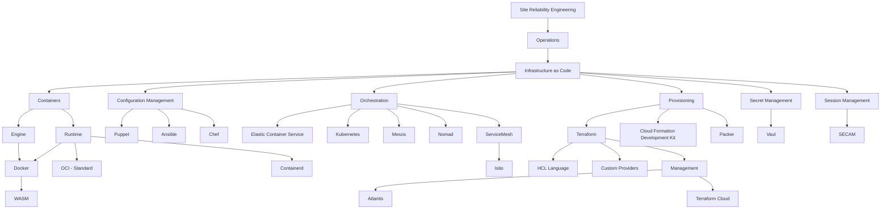

# [SRE](../../README.md) > [Operations](../README.md) > Infrastructure as Code

## Links

* [What is IaC?](https://www.youtube.com/watch?v=RO7VcUAsf-I) 📼 🆓
* [Getting Started with IaC](https://www.youtube.com/watch?v=G3D14I5_NIk) 📼 🆓
* Containers
  * Standard
    * OCI - [OpenContainers Initiative](https://opencontainers.org/)
    * Runtimes
      * [Docker](https://www.docker.com)
        * Guides
          * [Dockerfile Best Practices - ThoughtWorks](https://blog.docker.com/2019/07/intro-guide-to-dockerfile-best-practices/) 📰 🆓
        * Testing
          * [goss/dgoss](https://github.com/aelsabbahy/goss) - Test docker images ⭐️
            * [marceloboeira/kurz](https://github.com/marceloboeira/kurz) - Example setup ✍🏻
      * [Containerd](https://containerd.io)
    * WASM
      * [WebAssembly & Containers](https://www.youtube.com/watch?v=OGcm3rHg630) - Basic understanding of how WASM related to container runtimes 🆓📼
      * [CNCF - WASM: A revolutions for Browsers, Containers, and the Cloud - Justin Cormack](https://www.youtube.com/watch?v=uf0Rboi0mYg) 🆓📼
    * Orchestration
      * ECS
        * [ECS Workshop](https://ecsworkshop.com) 👨🏻‍🔧 🆓
        * Internals
          * [Service Discovery](https://www.youtube.com/watch?v=WLD7wqJzKEw) 📼 🆓
          * [Network Deep Dive](https://www.youtube.com/watch?v=2fwCg82pMI4) 📼 🆓
      * Nomad
        * [Intro to Nomad](https://www.youtube.com/watch?v=s_Fm9UtL4YU) 📼 🆓
        * [How does nomad work?](https://www.youtube.com/watch?v=UkXeRbzrWqo) 📼 🆓
        * [Nomad vs K8s](https://www.youtube.com/watch?v=GkmyNBUugg8) 📼 🆓
        * [A Kubernetes User Guide to Nomad](https://www.hashicorp.com/blog/a-kubernetes-user-s-guide-to-hashicorp-nomad) 📰 🆓 - Awesome side-by-side quivalent comparinson of the abstraction
      * Kubernetes
        * History
          * [Borg, Omega, and Kubernetes](http://static.googleusercontent.com/media/research.google.com/en//pubs/archive/44843.pdf) 📰 🆓
          * [Dockercon keynote: Eric Brewer (Google) - First k8s presentation](https://www.youtube.com/watch?v=YrxnVKZeqK8) 📼 🆓
        * Internals
          * Introduction
            * Microsoft Azure Videos
              * [Why you should care about containers](https://www.youtube.com/watch?v=EUitQ8DaZW8) 📼 🆓
              * [How Kubernetes works](https://www.youtube.com/watch?v=daVUONZqn88) 📼 🆓
              * [How Kubernetes deployments work](https://www.youtube.com/watch?v=mNK14yXIZF4) 📼 🆓
              * [Understand Serverless Kubernetes and Serverless on Kubernetes](https://www.youtube.com/watch?v=xL6lixC4D8Q) 📼 🆓
              * [How the Kubernetes scheduler works](https://www.youtube.com/watch?v=rDCWxkvPlAw) 📼 🆓
              * [Setting up a Kubernetes build pipeline](https://www.youtube.com/watch?v=5irsAdKoEBU) 📼 🆓
              * [Overview of common Kubernetes scenarios](https://www.youtube.com/watch?v=zd8vYhrFXp4) 📼 🆓
              * [How volumes and storage work in Kubernetes](https://www.youtube.com/watch?v=inJ7YJ-jt8I) 📼 🆓
              * [The basics of stateful applications in Kubernetes](https://www.youtube.com/watch?v=GieXzb91I40) 📼 🆓
          * [Understanding Distributed Consensus in etcd and Kubernetes - Laura Frank, CloudBees](https://www.youtube.com/watch?v=n9VKAKwBj_0) 📼 🆓
          * [Kubernetes Deconstructed: Understanding Kubernetes by Breaking It Down - Carson Anderson, DOMO](https://www.youtube.com/watch?v=90kZRyPcRZw) 📼 🆓
          * [Internals Advanced](https://container.training) General talks about containers - 🆓 📼
          * [Kubernetes Up and Running](http://shop.oreilly.com/product/0636920043874.do#tab_04_2) 📕 💰
          * [Key Kubernetes Concepts](https://towardsdatascience.com/key-kubernetes-concepts-62939f4bc08e) 📰 🆓
          * [Programming Kubernetes](https://learning.oreilly.com/library/view/programming-kubernetes/9781492047094/) 📕 💰
          * Networking
            * [A Guide to the Kubernetes Networking Model](https://sookocheff.com/post/kubernetes/understanding-kubernetes-networking-model/) 📰 🆓
            * [How does Traffic Flow inside a Kubernetes Cluster?](https://stackoverflow.com/questions/52241501/how-does-traffic-flow-inside-a-kubernetes-cluster) 📰 🆓
            * Exposing Services
              * [NodePort vs LB vs Ingress](https://medium.com/google-cloud/kubernetes-nodeport-vs-loadbalancer-vs-ingress-when-should-i-use-what-922f010849e0) 📰 🆓
                * Interesting to understand why ingress is a better option than LB when exposing individual services
                * LB creates a new IP for every service, it can get expensive and difficult to handle
                * Ingress can manage multiple domains and paths for many services without difficulty/effort
              * [Cracking K8s NodeProxy/KubeProxy](https://arthurchiao.art/blog/cracking-k8s-node-proxy/) 📰 🆓 ⭐️
              * [NodePort and iptables](https://ronaknathani.com/blog/2020/07/kubernetes-nodeport-and-iptables-rules/) 📰 🆓
            * CNI Plugins
              * [Kubernetes Networking: How to Write Your Own CNI Plug-in with Bash](https://www.altoros.com/blog/kubernetes-networking-writing-your-own-simple-cni-plug-in-with-bash/)
              * [Deep dive on the AWS CNI Plug-in for Kubernetes](https://www.youtube.com/watch?v=ezcnPcRcJdc) 📼 🆓
            * Identity & Access
              * RBAC
                * [RBAC.dev - List of Resources](https://github.com/mhausenblas/rbac.dev) 🌍 🆓
        * Operators
          * [Introducing Operators](https://coreos.com/blog/introducing-operators.html) 📰 🆓
        * Provider
          * EKS - Elastic Kubernetes Service
            * [EKS - Deep Dive](https://www.youtube.com/watch?v=EDaGpxZ6Qi0) 📼 📼
                * 08:50 - Control Plane
                * 10:19 - Control Plane Internals (not shared tenent, endpoints exposed to internet, worker nodes need access to the internet, NLB)
                * 19:00 - Version Updates
                * 20:00 - Authentication (IAM -> Authentication | RBAC -> Authorization)
                * 20:00 - [AMI is OpenSource](https://github.com/awslabs/amazon-eks-ami)
            * [EKS Workshop](https://www.eksworkshop.com) 👨🏻‍🔧 🆓
            * [Custom EKS AMIs](https://aws.amazon.com/premiumsupport/knowledge-center/eks-custom-linux-ami/) 📰 🆓
            * Metrics
              * [EKS + CloudWatch](https://www.youtube.com/watch?v=daLmE0tIcuk) 📼 🆓
              * [EKS + CloudWatch: Container Insights](https://www.youtube.com/watch?v=kn5TVKzBLrU) 📼 🆓
              * [Setup Metrics](https://docs.aws.amazon.com/AmazonCloudWatch/latest/monitoring/Container-Insights-setup-metrics.html) 📰 🆓
            * Tracing
              * [AWS X-Ray with EKS](https://aws.amazon.com/blogs/compute/application-tracing-on-kubernetes-with-aws-x-ray/) 📰 🆓
            * Windows
              * [Containerize .NET Apps with Amazon EKS](https://www.youtube.com/watch?v=GIH-MfkZPJA) 📼 🆓
            * Managed Node Groups
              * [EKS Managed Node Groups](https://aws.amazon.com/blogs/containers/eks-managed-node-groups/) 📰 🆓
         * Tenancy
           * [EKS Multi Tenency Design Considerations](https://aws.amazon.com/blogs/containers/multi-tenant-design-considerations-for-amazon-eks-clusters/) 📰 🆓
           * [Cost Management for MultiTenant Kubernetes](https://aws.amazon.com/blogs/containers/how-to-track-costs-in-multi-tenant-amazon-eks-clusters-using-kubecost/) 📰 🆓
           * [EKS - Tenancy Best Practices](https://aws.github.io/aws-eks-best-practices/security/docs/multitenancy/) 📰 🆓
           * [Loft - Kubernetes MultiTenancy](https://loft.sh/features/kubernetes-multi-tenancy)
           * [Architecting multi-tenant PaaS offerings with Amazon EKS](https://www.youtube.com/watch?v=P29eL_51iYU) 📼 🆓
          * Usecases
            * [Kubernetes Platform @ Pinterest](https://medium.com/pinterest-engineering/building-a-kubernetes-platform-at-pinterest-fb3d9571c948) 📰 🆓
          * Failure Stories
            * heycar outage:
              * [kube-dns : Intermittent dns issue from pods to external server](https://github.com/kubernetes/kubernetes/issues/47142) 😅
              * [5-15s DNS lookups on Kubernetes?](https://blog.quentin-machu.fr/2018/06/24/5-15s-dns-lookups-on-kubernetes/) 😅
              * [Kubernetes pods /etc/resolv.conf ndots:5 option and why it may negatively affect your application performances](https://pracucci.com/kubernetes-dns-resolution-ndots-options-and-why-it-may-affect-application-performances.html) 😅
      * Service Mesh
        * [What is service mesh?](https://www.youtube.com/watch?v=vh1YtWjfcyk) 📼 🆓
        * Consul
          * [Introduction to Consul](https://www.youtube.com/watch?v=mxeMdl0KvBI) 📼 🆓
          * [How Consul works with Kubernetes](https://www.youtube.com/watch?v=K93ZaUzwEWk) 📼 🆓
        * Istio
          * [Istio Explained - IBM Videos](https://www.youtube.com/watch?v=6zDrLvpfCK4) 📼 🆓
          * [What is Istio? ](https://www.youtube.com/watch?v=1iyFq2VaL5Y) 📼 🆓
            * Console
          * [Istio: Up & Running](https://learning.oreilly.com/library/view/istio-up-and/9781492043775/) 📕 💰
        * AppMesh
          * [AWS Container Day - App Mesh (Service Mesh Magic)](https://www.youtube.com/watch?v=hfzWtXKrv88) 🆓 📼
          * [AppMesh Workshop](https://www.appmeshworkshop.com) 👨🏻‍🔧🆓
          * [Microservice Deployment Strategies with AWS App Mesh](https://www.youtube.com/watch?v=UATTjvjoYEE) 🆓 📼
* Provisioning
  * Terraform
    * [Introduction to Terraform](https://www.youtube.com/watch?v=h970ZBgKINg) 📼 🆓
    * [Infrastructure as Code in the Real World?](https://www.youtube.com/watch?v=S6vS5mzivFo) 📼 🆓
    * [Terraform: Up and Running](https://learning.oreilly.com/library/view/terraform-up-and/9781491977071/) 📕 💰
    * [Terraform Tutorial – Getting Started With Terraform on AWS](https://spacelift.io/blog/terraform-tutorial)🆓 📰
    * HCL
      * [Terraform 0.12 dynamic for_each](https://www.hashicorp.com/blog/hashicorp-terraform-0-12-preview-for-and-for-each) 🆓 📰
      * [Loops and Dynamic Blocks with HCL](https://blog.boltops.com/2020/10/05/terraform-hcl-loops-with-dynamic-block) 🆓 📰
    * Management
      * [Terraform Cloud](https://www.terraform.io/cloud) - Run multiple terraform projects/states at scale
      * [Atlantis](https://www.runatlantis.io) - Alternative to Terraform Cloud running on OSS/Github/Gitlab integrations
    * Gotchas
      * [State Moves](https://www.terraform.io/docs/cli/commands/state/mv.html) 🆓 📰
      * [State Replace Provider](https://www.terraform.io/docs/cli/commands/state/replace-provider.html) 🆓 📰
    * Internals
      * Custom Providers
        * Build your own provider
          * [How to build a Usable Terraform Provider in 20 hours](https://www.youtube.com/watch?v=OoSAepwT0l4) 🆓 📼
          * [Terraform - Building custom providers](https://www.hashicorp.com/blog/writing-custom-terraform-providers) 🆓 📰
    * Certification
      * [Terraform Certification Crash Course - 13h](https://www.youtube.com/watch?v=V4waklkBC38) 📼 🆓
    * Scaling
      * [Terraform OpenCredos - Terraform life-cycle](https://www.hashicorp.com/resources/evolving-infrastructure-terraform-opencredo) 📼 🆓
        * This is only outdated in regards of module not supporting `for_each`, they do as of 1.0 or 0.12
      * [Google Cloud - Terraform Best Practices](https://cloud.google.com/docs/terraform/best-practices-for-terraform) 🆓
      * [Open Policy Agent](https://www.openpolicyagent.org/) - Policy-based control for cloud native environments 🆓
  * [CDK - CloudFormation Development Kit](https://docs.aws.amazon.com/cdk/latest/guide/home.html)
    * [Infrastructure is Code with CDK](https://www.youtube.com/watch?v=ZWCvNFUN-sU&feature=youtu.be) 📼 🆓
    * [CDK Best Practices](https://github.com/kevinslin/open-cdk) 💻 🆓 📰
  * Packer
    * [The Packer Book](https://learning.oreilly.com/library/view/the-packer-book/9780988820272/) 📕 💰
* Secret Management
  * [Vault](https://www.vaultproject.io) - Secure dynamic infrastructure across clouds and environments
    * [Introduction to Vault](https://www.youtube.com/watch?v=VYfl-DpZ5wM) 📼 🆓
* Session Management - See Session Manager Below
